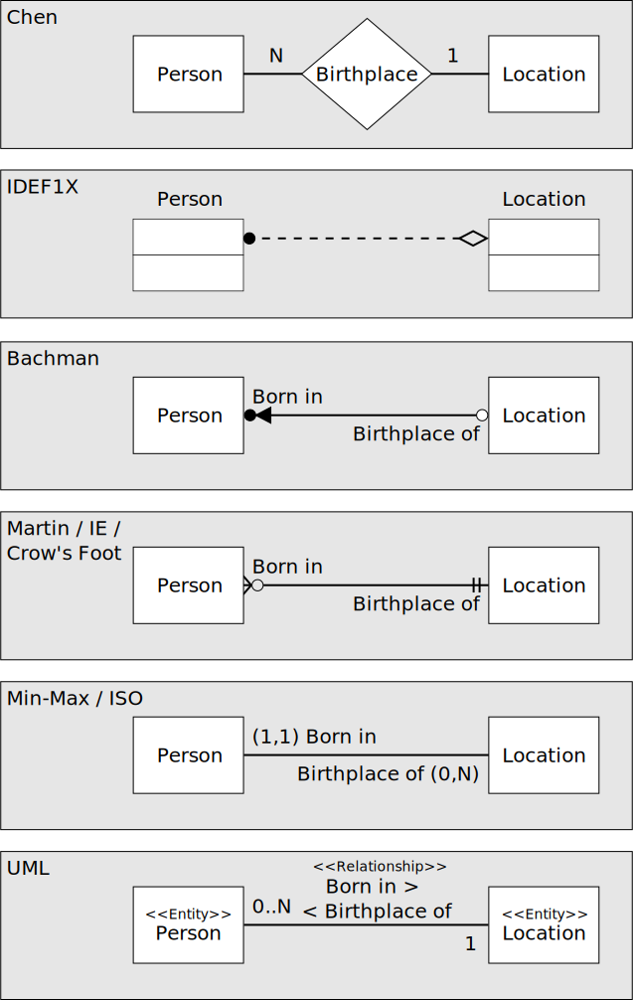

아래의 내용은 *한국데이터진흥원. 2013. SQL 전문가 가이드. 서울: (주)태산애드컴.*의 요약입니다.

제 1절 데이터 모델의 이해
========================
## 모델링의 이해
* 모델
    * 다양한 현상에 대해 일정한 표기법에 의해 표현해 놓은 모형
* 모델링
    * 표기법에 의해 규칙을 가지고 표기하는 것 자체
    * 특징
        * 추상화
        * 단순화
        * 명확화
    * 모델링의 세 가지 관점
        * 데이터 관점
        * 프로세스 관점
        * 데이터와 프로세스의 상관관점

## 데이터 모델의 기본 개념의 이해
* 데이터 모델링의 정의
    * 업무에서 필요로 하는 데이터를 시스템 구축 방법론에 의해 분석, 설계하여 정보 시스템 구축하는 과정

## 데이터 모델링의 중요성 및 유의점
* 데이터 모델링이 중요한 이유
    * 파급 효과 (Leverage)
    * 복잡한 정보 요구사항의 간결한 표현 (Conciseness)
    * 데이터 품질 (Data Quality)
* 데이터 모델링을 할 때 유의점
    * 중복 (Duplication)
    * 비유연성 (Infexibility)
    * 비일관성 (Inconsistency)

## 데이터 모델링의 3단계
* 추상화 수준에 따라 정리
* 개념적 데이터 모델링 (Conceptual Data Modeling)
    * 추상적, 포괄적, (회사 전체 차원인) 전사적 
    * 요구사항 분석
    * 엔티티-관계 다이어그램 생성
* 논리적 데이터 모델링 (Logical Data Modeling)
    * 비즈니스 정보의 논리적인 구조와 규칙을 명확하게 표현하는 기법 또는 과정
    * 정규화, 식별자 확정, M:M 관계 해소, 참조 무결성 규칙 정의 등 진행
* 물리적 모델링(Physical Data Modeling)
    * 데이터가 물리적으로 어떻게 저장될 것인가에 대해 정의
    * 물리적 저장구조와 저장 장치, 자료 추출하기 위해 사용될 접근 방법 등 결정

## 프로젝트 생명주기 (Life Cycle)에서 데이터 모델링
* Waterfall 기반
    * 분석과 설계 단계로 구분
    * 분석 단계에서 논리적 데이터 모델링 수행
    * 설계 단계에서 물리적 데이터 모델링 수행
* 나선형 모델
    * 분석, 설계 단계 양쪽에서 논리적, 물리적 데이터 모델링 수행
    * 분석 단계에서 논리적 데이터 모델링 더 많이 수행
* 데이터축과 어플리케이션축 구분되나, 객체지향 개념은 데이터 모델링과 프로세스 모델링 구분하지 않음

## 데이터 모델링에서 데이터독립성의 이해
* 데이터 독립성
    * 종속의 주체는 응용 (Application)
    * 응용은 사용자 요구사항을 처리하는 사용자 접점의 인터페이스 오브젝트를 의미
    * 필요성
        * 고유 특징을 명확하게 함
        * 다른 기능의 변경으로부터 쉽게 변경되지 않음
    * 구조, 독립성, 사상 (Mapping)에 대한 이해 필요
* 구조
    * 외부단계
        * 처리하고자 하는 데이터의 유형, 관점, 방법에 따라 스키마 구조 가짐
    * 개념 단계
        * 처리하는 데이터 유형의 공통적인 사항을 처리하는 통합된 뷰를 스키마 구졸 디자인한 형태
    * 내부적 단계
        * 물리적으로 저장된 방법에 대한 스키마 구조
* 독립성
    * 논리적인 독립성
    * 물리적인 독립성
* 사상
    * 상호 독립적인 개념을 연결
    * 외부적 / 개념적 사상 (논리적 사상)
    * 개념적 / 내부적 사상 (물리적 사상)

## 데이터 모델링의 중요한 세 가지 개념
* 엔티티
* 속성
* 관계

## 데이터 모델링의 이해관계자
* 모든 IT 기술자
* 해당 업무에서 정보화를 추진하는 위치에 있는 사람

## 데이터 모델의 표기법인 ERD의 이해

ERD 예시 (출처: https://commons.wikimedia.org/wiki/File:ERD_Representation.svg)

* ERD
    * 업무 분석에서 도출된 엔티티와 엔티티 간의 관계를 도식화된 다이터그램으로 표시하는 방법
    * 엔티티는 사각형으로 표현
    * 관계는 마름모로 표현
    * 속성은 타원형으로 표현
    * 중요한 엔티티를 왼쪽 상단에 배치하고, 이를 중심으로 다른 엔티티 나열
    * 처음에는 모두 식별자 관계 설정
    * 중복되는 관계 발생 지양
    * Circle 관계 발생 지양
    * 관계명은 현재형을 사용하고, 지나치게 포괄적인 용어는 사용 지양
    * 관계 차수 표현

## 좋은 데이터 모델의 요소
* 완전성 (Completeness)
* 중복 배제 (Non-Redundancy)
* 업무 규칙 (Business Rules)
* 데이터 재사용 (Data Reusability)
* 의사소통 (Communication)
* 통합성 (Integration)