아래의 내용은 개인적으로 공부한 내용을 정리한 것입니다. 잘못된 내용이 있다면 댓글 부탁드립니다!

- - -

윈도우 머신으로 개발 환경 설정하기가 까다로워, 도커를 활용해 리눅스를 사용하게 되었습니다.


본 포스트에서는 윈도우 머신에 도커를 설치하고 리눅스 (그 중에서도 우분투) 컨테이너를 실행하는 과정과 그 과정 중 발생하는 오류에 대해 다루고자 합니다. 

## 도커 (Docker)

운영체제 수준 가상화(Operating-system-level virtualization, 또는 Containerization)를 지원하는 컴퓨터 프로그램입니다.[1]


운영체제 수준 가상화란, 운영체제의 커널이 두 개 이상의 격리된 사용자 공간 인스턴스를 갖출 수 있도록하는 서버 가상화 방식을 의미합니다.[2]


(커널에 대한 자세한 내용은 [cmd.exe, Putty 그리고 Powershell](../_posts/cmd-putty-powershell)에서 다룰 예정입니다!)


이때 사용자 공간은 응용 소프트웨어와 일부 드라이버가 동작하는 메모리 영역을 뜻합니다.[3][4]


종합하자면, 도커는 운영체제의 커널 위에 두 개 이상의 격리된 공간에서 응용 소프트웨어 등이 동작할 수 있게 지원하는 프로그램입니다. 


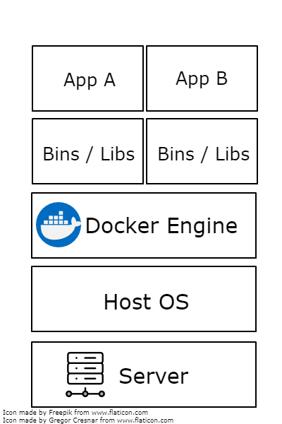


도커를 그림으로 표현한다면, 위와 같습니다.

- - -

Docker v.s. Virtual Machine


가상 머신을 그림으로 표현한다면, 위와 같습니다.


그림에서 확인할 수 있듯이 가상 머신은 도커와 달리 Host 운영체제 위에 Guest 운영체제를 포함합니다.


이에 따라 가상 머신은 도커에 비해 무겁고 느립니다.


([링크](http://pyrasis.com/book/DockerForTheReallyImpatient/Chapter01/01)에서 호스트 대비 도커의 성능을 확인하실 수 있습니다!)


가상 머신에 관한 자세한 내용은 [해당 포스팅](../run-linux-on-windows-01-virtual-machine)을 참고해주세요!

- - -

도커에 대한 보다 상세한 설명은 [링크](https://subicura.com/2017/01/19/docker-guide-for-beginners-1.html)를 추천드립니다!

## 도커 설치

docker store에 접속하여 운영체제에 맞는 도커를 설치해주세요. 


제가 도커를 설치했을 때 (2018년 4월 15일)에는 도커 설치 응용 프로그램 다운로드 시 사이트 로그인이 필요하지 않았는데, 이 글의 작성 시점인 2018년 7월 3일에는 사이트 로그인이 필요한 것으로 보입니다.


만일 도커 사이트 계정이 없을 경우 회원 가입 후 아래의 과정을 진행해 주세요.


제 머신의 운영체제는 Windows 10 Pro이기 때문에 [Docker Community Edition for Windows](https://store.docker.com/editions/community/docker-ce-desktop-windows)
를 다운로드 받았습니다. 


(참고로 도커는 무료인 Community Edition 외에 유료인 Enterprise Edition 역시 지원합니다.)


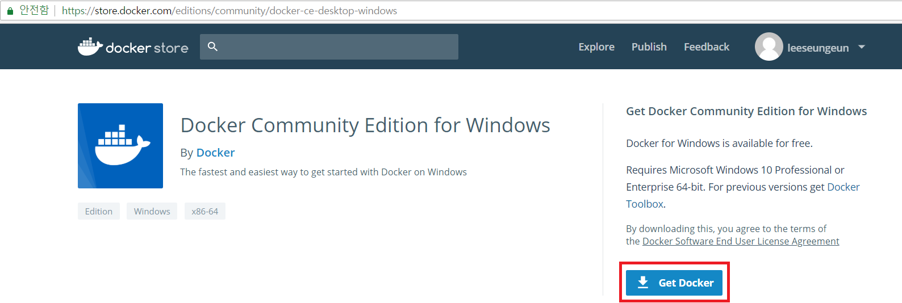


docker store에서의 Docker Community Edition for Windows 다운로드 화면입니다. 빨간 테두리의 사각형을 클릭하면 자동으로 다운로드가 진행됩니다.


도커 설치 응용 프로그램의 다운로드가 완료되면, 해당 파일을 실행해 도커 설치를 완료합니다.


도커 설치 여부를 확인하기 위해서 cmd.exe 또는 Powershell에서 ```docker```를 실행합니다. 아래와 같이 결과가 나온다면 설치가 완료된 것입니다.


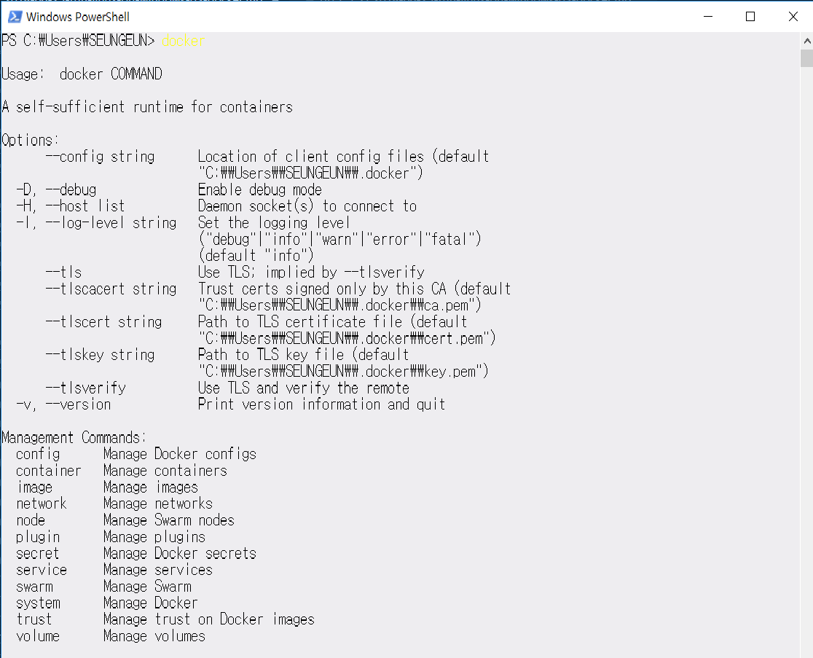

## 도커 컨테이너 실행 

저는 아래 세 개의 도커 컨테이너를 생성했습니다.
* MySql
* Postgres
* Ubuntu


- - -
도커 이미지 vs 도커 컨테이너


도커를 사용하시다 보면, 도커 이미지와 컨테이너라는 표현을 자주 접하시게 될 것입니다.


두 개의 개념의 정리하자면 아래와 같습니다.

* 도커 이미지
    * 변경 사항을 저장하는 레이어의 집합
    * 어플리케이션을 실행하는 데 필요한 모든 것을 포함하고 있는, 실행 가능한 패키지[5] 
* 도커 컨테이너
    * 이미지의 인스턴스[6]
- - -

* MySql


MySql 컨테이너를 생성하기 위해서 아래의 명령어를 사용했습니다.[7]

```
docker run --name mysql-container-name -e MYSQL_ROOT_PASSWORD=password -d mysql:tag
```

```docker run```은 새로운 컨테이너를 실행하기 위해 사용하는 명령어입니다.


컨테이너를 시작하기 위해서는 이미지를 실행해야 합니다.[6]


이미지를 받기 위해서 ```docker pull image:tag``` 명령을 실행해야 하지만, ```docker run``` 명령을 실행했을 때 이미지가 없으면 자동으로 ```docker pull```명령을 실시합니다.[8]
(tag는 버전이라고 생각하시면 좋을 것 같습니다. 최신 버전을 받고 싶으시다면, ```image:latest```명령어를 사용해주세요.)


명령에 사용한 옵션은 아래의 표를 참고해주세요.

옵션|설명
----|----
```--name``` | 컨테이너에 이름을 부여
```-e``` | 환경 변수 설정 (각 컨테이너 별로 설정할 수 있는 환경 변수는 [도커 허브](https://hub.docker.com)를 확인)
```-d``` | 백그라운드에서 컨테이너 실행


도커 컨테이너 생성을 확인하시고 싶으실 경우 ```docker ps -a```명령어를 cmd.exe 또는 Powershell에서 실행합니다.


```-a```옵션을 생략하는 경우 실행 중인 컨테이너만을 표시해줍니다.

* Postgres


Django와 Postgres의 궁합이 좋다고 하여 Postgres 컨테이너도 생성했습니다.


Postgres 컨테이너 생성을 위해 아래의 명령어를 사용합니다.[9]

```
docker run --name postgres-container-name -e POSTGRES_PASSWORD -d postgres:tag
```

환경 변수명 외에는 위의 MySql에서의 설명과 동일합니다.


* Ubuntu


대망의 우분투 컨테이너 실행입니다. 


컨테이너 실행 명령어는 아래와 같습니다.

```
docker run -i -t -v /drive/local-directory/:/container-directory -p host-port-num:docker-port-num --link container-name:alias --name ubuntu-container-name ubuntu:tag
```

위에서 설명하지 않은 옵션에 대한 설명은 아래와 같습니다.


(보다 의미를 정확하게 전달하기 위해 일부 영어 단어를 그대로 사용했습니다.)

옵션|설명
----|----
```-i``` | ```-t``` 옵션과 함께 사용하고 컨테이너에 어태치 (attach)되지 않을 때에도 STDIN (Standard Input, 표준 입력) 유지
```-t``` | ```-i``` 옵션과 함께 사용하고 Bash를 사용하기 위해 pseudo-TTY(터미널 에뮬레이터[10]) 지원
```-v``` | 호스트의 볼륨을 컨테이너에 마운트 (mount)
```-p``` | 도커의 포트를 호스트의 포트에 퍼블리시 (publish)
```--link``` | 실행하고자 하는 컨테이너에 다른 컨테이너를 연결


Docker for Windows의 특징 때문에 컨테이너 실행 시 많은 어려움을 겪었었는데, 나타난 순서에 따라 하나씩 정리하고자 합니다.

1. 마운트할 볼륨 드라이브 지정


    ```docker run```의 ```-v``` 옵션을 사용할 때 마운트할 볼륨을 지정해줘야 합니다.


    이때 ```\드라이브명\디렉토리``` 형태로 마운트할 볼륨의 드라이브를 지정해주면 됩니다.


    중요한 점은 **드라이브명은 소문자를 이용**해야 한다는 점입니다.[11]


2. 파일 공유 시 방화벽 문제


    그 다음 만난 문제는 파일 공유 시 방화벽 문제입니다. 문제가 발생하면 아래와 같은 메시지가 나타납니다.


    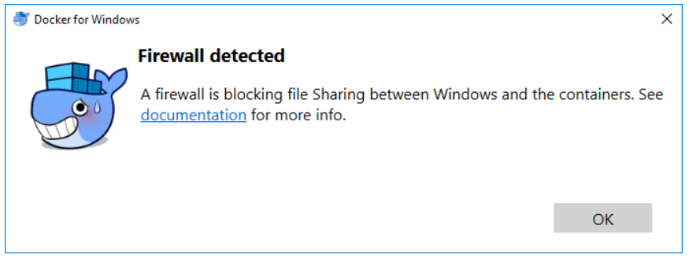


    사용하고 있는 방화벽을 해지해도 위의 메시지가 나타날 수 있습니다.


    이 문제의 원인과 해결방법을 이해하기 위해서는 리눅스 운영체제 위에서의 도커와 Docker for Windows 간의 차이를 이해해야 합니다.

    - - -
    [이하 출처](http://web-front-end.tistory.com/79)


    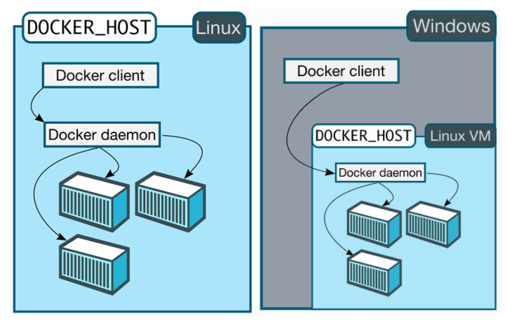


    위의 그림에서 확인할 수 있듯이, 윈도우 위에서는 리눅스에서와 달리 리눅스 가상 머신 (Hyper-V라는 윈도우 네이티브 (native) 하이퍼바이저 이용) 위에 도커 엔진이 동작합니다.


    그 이유는 도커가 리눅스 컨테이너 (Linux Container, LXC)라는 운영체제 수준의 가상화 기술을 이용해, 리눅스 외의 운영체제에서는 리눅스 가상 머신을 필요로 하기 때문입니다.
    - - -

    이때 기본적으로 445번 포트를 사용하기 때문에 해당 포트가 열려 있는지 확인해야 합니다.


    이는 (Windows 10 기준) Windows Defender 보안 센터 > 고급설정 > 인바운드 규칙에서 확인해주세요 (아래 그림 참조).


    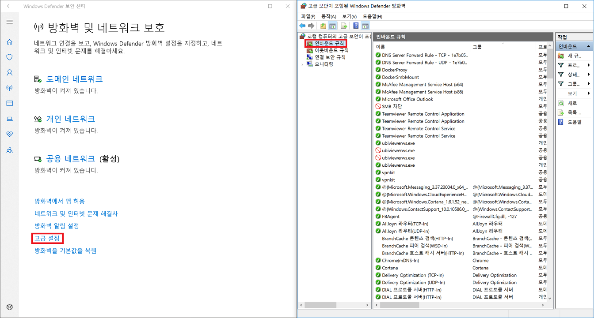


3. 컨테이너에서 마운트한 볼륨의 파일 등이 표시되지 않는 경우

    파일 공유를 위해서는 윈도우 사용자 인증 정보가 필요합니다. 인증 정보가 일치하지 않는 경우 파일 등이 컨테이너 안에서 표시되지 않을 수 있습니다.


    필자의 경우 윈도우 사용자 인증 정보 변경으로 해당 문제가 발생했는데, 아래와 같이 진행하여 문제를 해결했습니다.[12]


    우선 도커 세팅에 들어갑니다.


    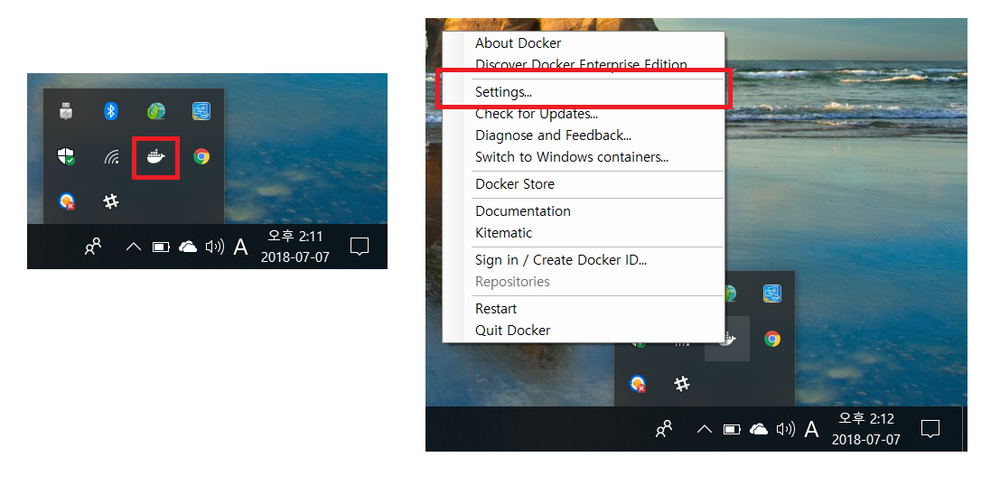


    위 그림 좌측의 도커 아이콘을 우클릭하면 그림의 우측과 같이 세팅에 진입할 수 있습니다.


    세팅에서 **Shared Drives** 탭에 진입합니다. 아래의 그림과 같이 모든 드라이브의 **Shared 체크 해지**해주시고, **Reset Credentials**를 클릭해줍니다.


    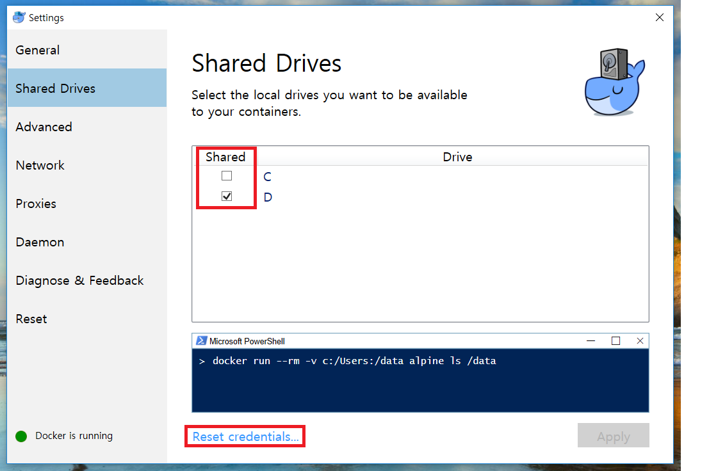


    이제 아래 그림과 같이 내 컴퓨터 > 마운트할 드라이브를 우클릭 후 속성을 클릭해줍니다.


    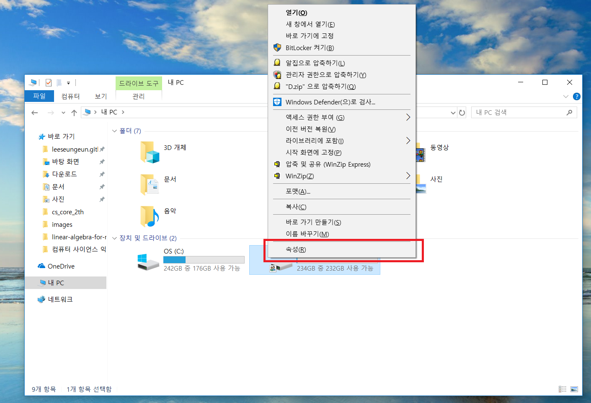


    이후 공유 탭에 들어가 고급 공유 > 선택한 폴더 공유 체크를 해지해줍니다.
    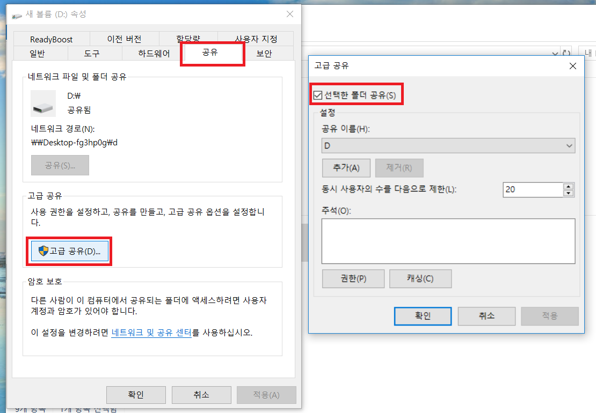


    다시 도커 세팅 > Shared Drives에서 공유할 드라이브를 체크해주시고 **Apply**를 눌러 윈도우 사용자 인증 정보를 기입합니다.


4. 호스트 80 포트의 사용


    윈도우의 경우 80과 같은 일반 포트(general port, ports < 1024)는 시스템에 의해 보호 받습니다.[13]


    (이 경우 아래와 같은 메시지가 표시됩니다.)

    ```
    docker: Error response from daemon: driver failed programming external connectivity on endpoint XXXXX: Error starting userland proxy: Bind for 0.0.0.0:80: unexpected error Permission denied.
    ```


    굳이 80 포트이어야 할 필요가 없어 필자는 호스트 8000로 컨테이너 실행을 진행했습니다.


5. 컨테이너 생성 혹은 기기 종료 후 재실행 시 포트 초기화 문제


    해당 문제는 윈도우 운영체제에서 종종 발견되는 문제로 보입니다.[14]


    문제 발생 화면은 아래와 같습니다.


    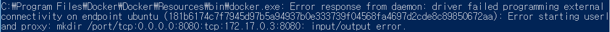


    이 문제에 대한 해결 방법은 크게 두 가지가 제시되고 있는데, 첫번째는 아래 그림과 같이 제어판 > 전원 옵션 > 전원 단추 정의 및 암호 보호 설정에서 종료 설정 > 빠른 시작 켜기 체크 해지하는 방법입니다.


    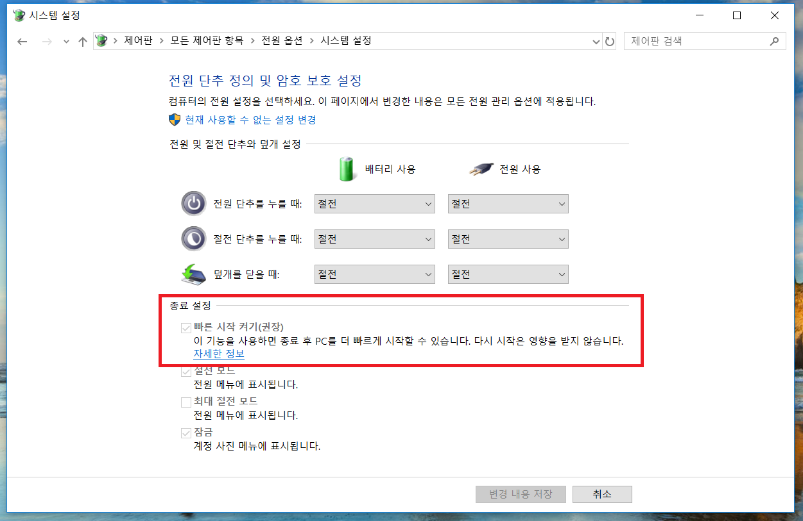


    두 번째 방법은 도커 사용 후 모든 컨테이너를 실행 종료하고, 도커까지 종료시키는 방법입니다.


    일부 첫 번째 방법은 권장하지 않는 의견이 있어, 필자는 두 번째 방법을 사용하고 있습니다.


우분투 컨테이너의 생성이 완료되었다면, ```docker start container-name```명령어를 이용해 컨테이너를 실행합니다.(주의하셔야 할 점은 ```--link``` 옵션으로 연결된 컨테이너부터 실행해야 한다는 점입니다. ```docker-compose```를 이용하면 이를 보다 쉽게 관리할 수 있다고 하는데, 이에 대해서는 추후에 공부하여 포스팅하도록 하겠습니다!)


우분투 컨테이너는 ```-it``` 옵션을 사용했기 때문에 ```docker attach container-name``` 명령어를 사용하면, 우분투 컨테이너의 Bash 셸을 이용할 수 있습니다.


이상이 윈도우 머신에 도커로 리눅스 (우분투) 컨테이너 실행하는 과정과 그 과정 중 발생한 문제들을 정리한 내용입니다.


도커 명령어 사용이 생소해 어려우셨던 분들은 아래의 내용도 함께 읽어주시길 부탁드리겠습니다.


## Docker Kitematic

Docker Kitematic을 이용하면 GUI 상으로 도커를 제어할 수 있습니다.


CLI 환경이 익숙하지 않으셔서 위의 설명이 조금 어려우셨던 분들은 Docker Kitematic의 이용을 추천 드립니다.


### 설치 방법


도커 아이콘을 우클릭 해 Kitematic을 클릭한다면 아래와 같이 메시지가 나타납니다. 좌측에 **Download**를 클릭해주세요.


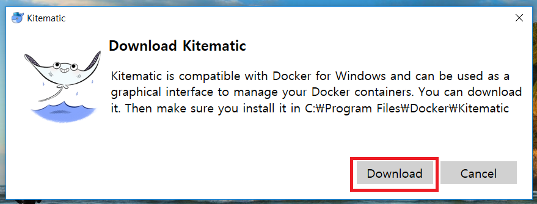


버튼을 클릭하면 ZIP 파일이 다운로드됩니다. 알집 등의 프로그램으로 ZIP 파일의 압축을 풀어주세요.


알집 해제 후 아래의 그림의 파일을 클릭해주시면, Docker Kitematic이 실행됩니다. Docker Kitematic에서 CLI와 동일하게 ```docker pull```부터 ```docker run```의 ```--link``` 등의 옵션도 이용 가능합니다. 자세한 설명 방법이 궁금하시다면 댓글 부탁드립니다:) 가능한 빨리 답변 드리도록 하겠습니다!!


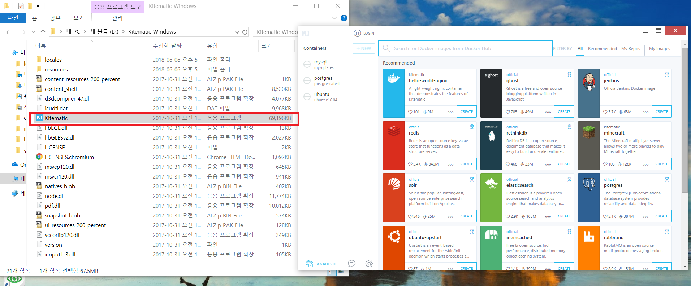

[1]: https://en.wikipedia.org/wiki/Docker_(software)
[2]: https://ko.wikipedia.org/wiki/%EC%9A%B4%EC%98%81_%EC%B2%B4%EC%A0%9C_%EC%88%98%EC%A4%80_%EA%B0%80%EC%83%81%ED%99%94
[3]: https://ko.wikipedia.org/wiki/%EC%82%AC%EC%9A%A9%EC%9E%90_%EA%B3%B5%EA%B0%84
[4]: https://en.wikipedia.org/wiki/User_space
[5]: https://docs.docker.com/get-started
[6]: https://stackoverflow.com/questions/23735149/what-is-the-difference-between-a-docker-image-and-a-container
[7]: https://hub.docker.com/_/mysql 
[8]: https://github.com/moby/moby/issues/34394
[9]: https://hub.docker.com/_/postgres
[10]: https://unix.stackexchange.com/questions/4126/what-is-the-exact-difference-between-a-terminal-a-shell-a-tty-and-a-con
[11]: https://forums.docker.com/t/how-to-share-volumes-and-or-drives-using-docker-machine-on-windows-not-beta/20170
[12]: http://peterjohnlightfoot.com/docker-for-windows-on-hyper-v-fix-the-host-volume-sharing-issue
[13]: https://stackoverflow.com/questions/46533482/error-starting-userland-proxy-bind-for-0-0-0-080-unexpected-error-permission
[14]: https://github.com/docker/for-win/issues/573
