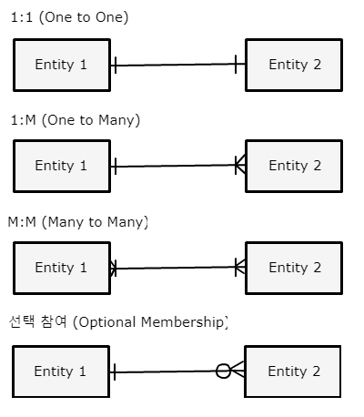

아래의 내용은 *한국데이터진흥원. 2013. SQL 전문가 가이드. 서울: (주)태산애드컴.*의 요약입니다.

## 관계의 개념
* 관계 (Relationship)
    * 엔터티 인스턴스 사이의 논리적인 연관성
    * 존재의 형태로서나 행위로서 서로에게 연관성이 부여된 상태
* 관계 페어링 (Relationship Pairing)
    * 각 엔터티의 인스턴스들이 관련된 인스턴스들과 관계의 어커런스로 참여하는 형태

## 관계의 분류
* 연결된 목적에 따른 분류
    * 존재에 의한 관계
        * UML (Unified Modeling Language)의 클래스다이어그램 상 연관 관계 (Association)
    * 행위에 의한 관계
        * UML의 클래스다이어그램 상 의존 관계 (Dependency)

## 관계의 표기법
* 관계명 (Membership)
    * 관계시작점 (The Beginning)과 관계끝점 (The End) 모두 관계 이름 가짐
    * 참여자의 관점에 따라 능동적 (Active) 또는 수동적 (Passive)으로 명명
    * 애매한 동사 사용 지양
    * 현재형으로 표현
* 관계 차수 (Degree / Cardinality)
    * 두 개의 엔터티 간 관계에서 참여자 수 표현하는 것
    * 1:1 (One to One)
    * 1:M (One to Many)
    * M:M (Many to Many)
        * 두 개의 주식별자를 이용해 3개 엔터티로 구분하여 표현

## 관계 선택 사양 (Optionality)
* 필수 참여 (Mandatory Membership)
    * 모든 참여자가 관계 가짐
* 선택 참여 (Optional Membership)
    * Foreign Key로 연결될 경우 Null 허용
    * 원으로 표시
* 0:0 (Zero to Zero)의 관계는 잘못되었을 확률이 높으므로 검토 필요

관계 표현 예시

## 관계의 정의 및 읽는 방법
* **각각의 / 하나의 기준 엔터티는(은) 하나의 / 하나 이상의 관계 엔터티가(이) 항상 / 때때로 관계명**의 형식으로 읽음