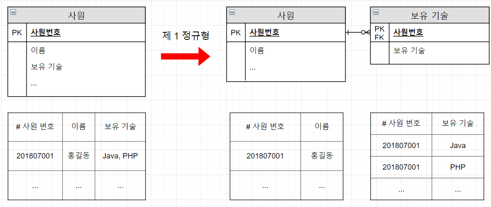
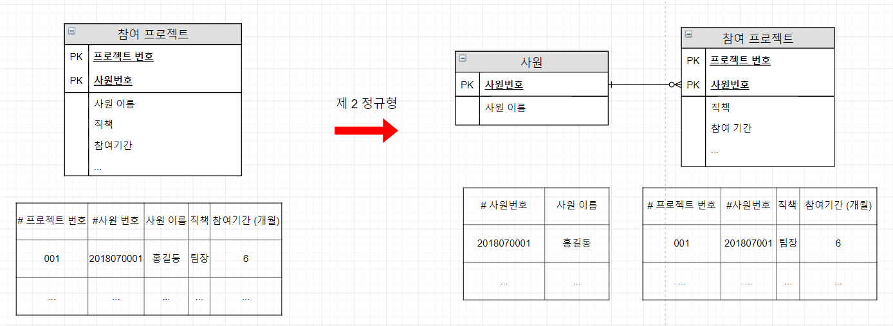
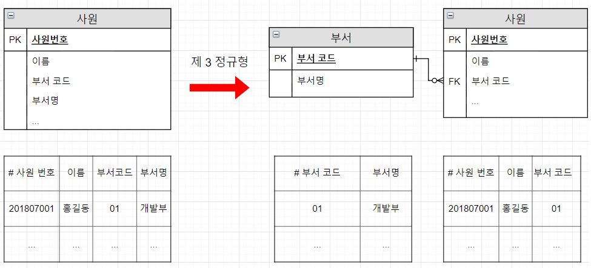
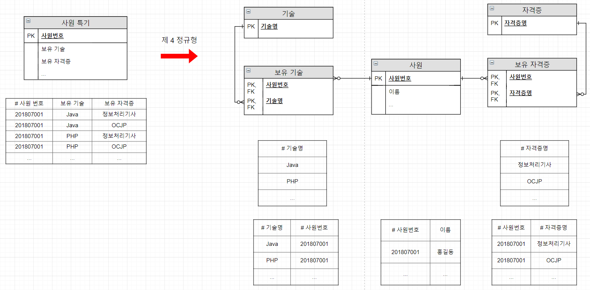
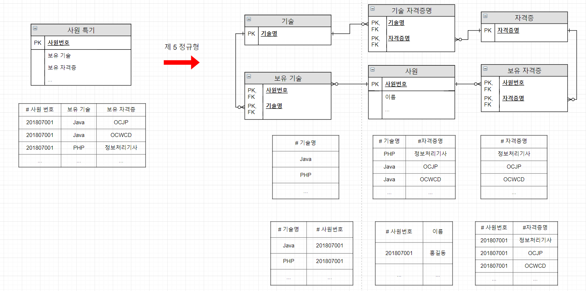
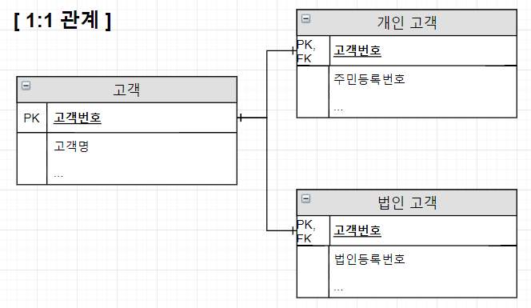
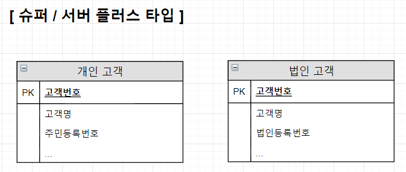
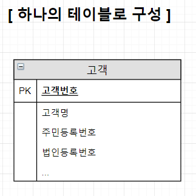

아래의 내용은 *한국데이터진흥원. 2013. SQL 전문가 가이드. 서울: (주)태산애드컴.*의 요약에 개인적으로 공부한 내용을 추가해 작성했습니다.

잘못된 내용이 있다면 댓글 부탁드립니다!
- - -

* 데이터베이스 성능
    * 데이터 조회 성능
    * 입력 / 수정 / 삭제 성능

* 데이터베이스 성능이 저하되는 원인
    * 데이터 모델 구조
    * 대용량의 데이터
    * 인덱스 특성을 충분히 고려하지 않고 생성한 인덱스

### 성능 데이터 모델링
데이터베이스의 성능 향상을 위해 데이터 모델링 시 성능 관련 사항을 반영하는 것

* 사전에 할수록 성능 향상을 위한 비용이 들지 않음

### 성능 데이터 모델링 과정
1. 정규화
2. 용량 산정
3. 트랜잭션 유형 파악
4. 용량과 트랜잭션의 유형에 따른 반정규화
5. 이력모델 조정, 기본키 (Primary Key, PK) / 외래키 (Foreign Key, FK) 조정, 슈퍼 타입/ 서브 타입 조정 등 수행
6. 성능 관점에서 데이터 모델 검증

#### 1. 정규화

* 데이터에 대한 중복성 제거

    데이터가 불필요하게 중복되면 릴레이션 조작 시 
    * 삽입 이상 (Insertion Anomaly)
        * 릴레이션에 데이터 삽입할 때 의도하지 않은 값들도 함께 삽입되는 현상
    * 삭제 이상 (Deletion Anonmaly)
        * 릴레이션에서 한 튜플을 삭제할 때 의도하지 않은 값들도 함께 삭제되는 현상
    * 갱신 이상 (Update Anomaly)
        * 릴레이션 안 튜플에 있는 속성값을 갱신할 때 일부 튜플 정보만 갱신되어 모순이 발생하는 현상

    발생할 수 있음[1]
* 관심사 별로 데이터 처리
* 함수적 종속성 (Functional Dependency)에 근거
    * 데이터의 근본적 속성으로, 데이터들이 어떤 기준값에 의해 종속되는 현상
    * 결정자 (Determinant)
        * 기준값
    * 종속자 (Dependent)
        * 종속되는 값

* 정규화를 통해
    * 입력 / 수정 / 삭제 성능이 향상될 수 있음
        * 데이터 용량이 최소화되기 때문
    * 조회 성능이 향상될 수도, 저하될 수도 있음

- - -
[이하 출처](http://whitehats.tistory.com/29)
* 릴레이션
    * 하나의 엔터티 또는 관계에 대한 데이터를 2차원 테이블 (표) 구조로 표현한 것
* 튜플 (또는 레코드)[2]
    * 릴레이션의 행

- - -

이하 출처 목록
* http://whitehats.tistory.com/30?category=632088
* http://wiki.gurubee.net/pages/viewpage.action?pageId=33751579

##### 제 1 정규형 (1NF)
* 릴레이션의 모든 도메인이 원자값만을 가지게 됨
    * 각 행 (row)마다 컬럼의 값이 1개씩 있어야 함을 의미
* 다가 속성과 복합 속성과 관련[3]
    * 다가 속성 (Multivalued Attribute)
        * 같은 종류 값을 여러 개 갖는 속성
    * 복합 속성 (Composite Attribute)
        * 여러 개 속성으로 분리될 수 있는 속성

    

    제 1 정규형 예시

##### 제 2 정규형 (2NF)
* 제 1 정규화를 충족하며, 키를 제외한 모든 속성이 **기본키**에 대해 **완전** 함수적 종속 관계를 만족
    * 완전 함수적 종속 관계
        * 속성 A가 다른 속성들의 집합 B에 대해 함수적 종속성을 가지지만, 집합 B의 진부분집합(자기자신을 포함하지 않는 부분집합)에 대해서 종속관계를 가지지 않는 경우

    

    제 2 정규형 예시

    직책, 참여기간은 기본키인 프로젝트 번호와 사원번호에 종속되지만,

    사원이름은 사원번호에만 종속되어 완전 함수적 종속 관계를 만족하지 않음

##### 제 3 정규형 (3NF)
* 제 2 정규화를 충족하며, 키가 아닌 모든 속성이 기본키에 대해 이행적 종속 관계 (Transitive Dependency)를 이루지 않음
    * 이행적 종속 관계
        * X, Y, Z가 릴레이션 R의 속성 집합일 때, Y가 X에 종속적이고 Z가 Y에 종속적이면 Z는 X에 종속적임을 의미[3]

    

    제 3 정규형 예시 

    부서코드는 사원번호에 종속적이고 부서명은 부서코드에 종속적이므로, 사원번호와 부서명은 이행적 종속 관계를 이룬다고 볼 수 있음

###### 제 2 정규형 vs 제 3 정규형
* 제 2 정규형을 위배한 경우 종속성이 기본키의 일부에서 관찰되며, 제 3 정규형을 위배한 경우 종속성이 키가 아닌 속성에서 관찰된다는 점이 차이

* 구체적인 내용은 아래를 참조
    * https://stackoverflow.com/questions/6023091/normalisation-2nf-vs-3nf
    * https://yaboong.github.io/database/2018/03/09/database-normalization-1
    * http://noritersand.tistory.com/390
    * http://myeonguni.tistory.com/210

##### Boyce-Codd 정규형 (BCNF)
* 결정자가 모두 후보키인 관계형
* 제 3 정규형과 동일해 강한 제 3 정규형이라고도 함

##### 제 4 정규형 (4NF)
* 다치 종속 (다가 종속, Multivalued Dependency, MVD)이 제거됨
    * 다치 종속
        * 한 릴레이션에 다가 속성이 두 개 이상 존재할 때, 하나의 다가 속성의 모든 값이 다른 다가 속성의 값마다 중복되는 현상

     

    제 4 정규형 예시

###### 제 1 정규형 vs 제 4 정규형
* 제 1 정규형이 다가 속성을 엔터티로 분해하는 것이라면, 제 4 정규형은 서로 관계 없는 다가 속성을 개별 엔터티롤 분해하는 것이 차이
* 제 1 정규형에 따를 경우 다가 종속 제거됨

##### 제 5 정규형 (5NF, Project-Join Normal Form, PJ/NF)
* 조인 종속 (Join Dependency)이 제거됨
    * 조인 종속
        * 릴레이션 R이 R의 속성 부분집합을 모두 조인한 결과와 동일한 경우[4][5] 

     

    제 5 정규형 예시

###### 제 4 정규형 vs 제 5 정규형
* 제 4 정규형에서 두 속성 간 연관성이 낮다면, 제 5 정규형에서 두 속성 간 연관성이 높다는 점이 차이

#### 반정규화

* 함수적 종속 관계를 위반하지 않는 범위에서 정규화된 엔터티, 속성, 관계에 중복, 통합, 분리 등을 수행하는 데이터 모델링 기법
* 반정규화가 필요한 경우
    * 조회할 때 디스크 I/O량이 많은 경우
    * 경로가 멀어 조인으로 성능 저하가 예상되는 경우
* 반정규화 대상
    * 테이블에 접근 프로세스 수가 많고 항상 일정한 범위만을 조회하는 경우
    * 대량의 데이터를 자주 처리하고 처리 범위를 일정하게 줄여야 성능을 보장할 수 있는 경우
    * 통계 정보가 필요한 경우
    * 지나치게 많은 조인이 걸리는 경우
* 반정규화 외 해결 방법
    * 반정규화 외 해결 방법이 가능하다면 해당 방법을 사용
    * 지나치게 많은 조인이 걸리는 경우: 성능을 고려한 뷰 생성
    * 대량의 데이터나 부분 처리의 경우: 클러스터링 적용 (입력 / 수정 / 삭제 성능 저하가 심하므로 조회 중심 테이블에 적용), 인덱스 조정, 파티셔닝 기법 (Partitioning)
    * 이외의 방법: 캐시 등 응용 어플리케이션에서 로직 구사

* 반정규화의 기법
    * 테이블 반정규화

        기법 분류|기법
        ---------|----
        테이블 병합|1:1 관계 테이블 병합, 1:M 관계 테이블 병합, 슈퍼 / 서브 타입 테이블 병합
        테이블 분할|수직 분할 (칼럼단위 분할), 수평 분할 (로우 단위 분할)
        테이블 추가|중복 테이블 추가, 통계 테이블 추가, 이력 테이블 추가, 부분 테이블 추가

    * 칼럼 반정규화
        * 중복 칼럼 추가: 조인 감소 목적
        * 파생 칼럼 추가: 계산에 의해 발생하는 성능 저하 방지
        * 이력 테이블 칼럼 추가: 대량의 이력 데이터 처리 시 성능 저하 방지
        * 기본키에 의한 칼럼 추가: 복합 의미를 갖는 기본키를 단일 속성으로 구성한 경우 일반 속성으로 포함
        * 응용 시스템 오작동을 위한 칼럼 추가: 복구를 목적으로 함

    * 관계 반정규화
        * 중복 관계 추가

- - -
* 비정규화
    * 정규화를 수행하지 않은 상태

- - -

#### 대량 데이터에 따른 성능
* 대량의 데이터가 존재함으로써 성능이 저하될 수 있는 경우의 수
    * 처리되는 양이 한 군데로 몰려 발생하는 성능 저하
        * 테이블 단위 분할로 해결
    * 대량의 데이터로 인덱스 트리 구조가 커짐으로써 효율이 떨어져 많은 디스크 I/O 유발
        * 기본키에 의한 테이블 분할
        * 파티셔닝 (Partitioning)
            * 논리적으로 하나의 테이블처럼 보이지만, 물리적으로 여러 개의 테이블 스페이스에 쪼개어 저장하는 구조
            * Range Partition
                * 날짜 또는 숫자값으로 분리 가능하고, 각 영역별로 트랜잭셩이 발생하는 테이블에 적용
                * 데이터 보관 주기에 따른 테이블 관리가 용이
            * List Partition
                * 핵심적인 코드값으로 기본키가 구성되어 있는 테이블에 적용
                * 데이터 보관 주기에 따른 테이블 관리는 어려움
            * Hash Partition
                * 해싱 알고리즘을 사용해 테이블 분리
                * 데이터 보관 주기에 따른 테이블 관리는 어려움
                    * 설계자가 테이블에 데이터가 정확하게 어떻게 들어갔는지 알 수 없기 때문 
    * 테이블의 컬럼이 많아져 여러 물리적 디스크 블록에 데이터가 저장되며 SQL 문장 성능 저하
        * 로우 체이닝 (Row Chaining)
            * 길이 때문에 두 개 이상의 블록에 걸쳐 하나의 행이 저장되어 있는 형태
        * 로우 마이그레이션 (Row Migration)
            * 데이터 블록에 수정이 발생할 때 수정된 데이터를 해당 데이터 블록에 저장하지 못하고 다른블록의 빈 공간에 저장하는 방식 
        * 트랜잭션이 집중되어 발생하는 컬럼을 찾아 테이블을 분할
* 테이블 분할 시 
    * 모델링
    * 용량 산정 및 트랜잭션 처리 패턴 분석
    * 집중화 처리 단위 (로우 또는 컬럼)에 따른 분할

    을 거침 

#### 데이터베이스 구조와 성능
* 슈퍼 / 서브 타입 데이터 모델
    * 슈퍼 타입[6]
        * 관계 속성을 포함해, 여러 엔터티에 중복되어 나타나는 속성을 도출
    * 서브 타입[6]
        * 슈퍼 타입의 속성을 상속 받음
    * 성능 저하에 영향을 미치는 경우의 수 
        * 트랜잭션 유형에 따름
            * 트랜잭션은 일괄 처리하나 개별로 유지되어 Union 연산에 의한 성능 저하
            * 트랜잭션은 서브타입 개별로 처리하나 테이블이 통합되어 불필요한 데이터 집약으로 성능 저하
            * 슈퍼 / 서브 타입 공통으로 처리하나 개별로 유지되거나 하나의 테이블로 집약되어 성능 저하
    * 데이터가 소량인 경우
        * 유연성을 고려해 가급적 1:1 관계 유지
    * 데이터가 대량인 경우
        * 1:1 관계로 개별 테이블 유지
            

            

            * 슈퍼 타입이 서브 타입에 대한 기준 역할을 하는 경우 사용
            * 장점
                * 확장성이 우수함
                * I/O량 성능이 나쁨
            * 단점
                * 조인 성능이 나쁨
                * 관리 용이성이 좋지 않음
        * 슈퍼 / 서브 플러스 타입으로 구성
            

            

            * 슈퍼 타입과 서브 타입을 묶어 별도의 테이블로 구성
            * 슈퍼 타입과 서브 타입을 묶어 트랜잭션이 발생하는 경우 사용
            * 확장성은 보통임
            * 장점
                * I/O량 성능이 좋음
            * 단점
                * 조인 성능이 나쁨
                * 관리 용이성이 좋지 않음
        * 하나의 테이블로 구성

            

            * 항상 통합하여 데이터를 처리할 경우 사용
            * 장점
                * 조인 성능이 우수함
                * 관리가 용이함
            * 단점
                * 확장성이 낮음
                * I/O량 성능이 나쁨
* 인덱스
    * 접근 경로를 제공하는 오브젝트
    * B*트리 구조 많이 사용
        [이하 출처](http://lovelyseoul.tistory.com/26)
        * B*트리
            * B트리보다 노드 분할을 줄여서 보조 연산을 줄임으로써 성능을 개선하려 함
            * 특징
                * 루트를 제외한 모든 노드는 2/3 이상 채워져야 함
                * 노드가 가득차면 분할하는 대신 이웃한 형제 노드로 재배치
                * 한 노드가 가득차고 인접 노드까지 모두 가득 찰 때까지 분할을 지연
        * B 트리
            * 특징
                * 탐색/삽입/삭제 시 성능 O(logn)
                * 한 노드에 m개의 자료, m+1개의 자식을 가질 수 있음
                * 검색 시 각 노드 당 최대 m번의 선형검색
                * m차 B트리의 높이는 이하
                * 외부 검색에 적합 
                * 하나의 노드 크기를 디스크 I/Ov단위 크기로 함
    * 종류[7]
        * 클러스터형 인덱스
            * 한 테이블에 하나만 생성 가능
            * 지정된 열에 대해 자동 정열
        * 비클러스터형 인덱스
            * 한 테이블에 여러 개 생성 가능
            * 책의 색인과 같은 역할
    * Primary Key, Unique Key 제약 조건은 인덱스를 자동 생성[7]
    * 기본키 순서 중요
        * 기본키 앞쪽에 위치한 속성이 비교자로 있어야 효율적
    * 외래키 인덱스 생성
        * 조인 경로를 제공하기 때문에 필요

#### 분산 데이터베이스와 성능
* 네트워크 환경을 이용해 여러 지역 / 노드에 데이터베이스를 위치시켜 사용성과 성능을 극대화 시킨 데이터베이스
* 아래 6가지 투명성 (Transparency) 만족
    * 분할 투명성 (단편화)
    * 위치 투명성
    * 지역사상 투명성
    * 중복 투명성
    * 장애 투명성
    * 병행 투명성
* 통합 데이터 모델링 수행 후 업무 특징에 따라 테이블을 지역 / 서버별로 분산 / 복제 배치해 설계
* 최근은 통합 데이터베이스 구축 사례가 더 많음
* 분산 종류
    * 테이블 위치 분산
        * 설계된 테이블을 다르게 위치
    * 테이블 분할 (Fragment) 분산
        * 테이블을 쪼개어 분산
        * 분리 단위에 따라 수평 분할 (Horizontal Fragment, 로우 단위 분리)과 수직 분할 (Vertical Fragment, 칼럼 단위 분할)로 나뉨
        * 데이터 조합 시 중복이 발생하지 않아야 함
        * 통합 처리가 많지 않은 경우 사용
    * 테이블 복제 (Replication) 분산
        * 동일 데이터를 여러 지역 /  서버에 동시에 생성해 관리
        * 마스터 데이터베이스의 복제 범위에 따라 광역 복제 (Broadcast Replication, 전부 복제)와 부분 복제 (Segment Replication, 일부만 복제)로 나뉨
        * 데이터 복제에 소요되는 시간, 데이터베이스와 서버의 부하를 고려해 야간에 배치 처리로써 복제
    * 테이블 요약 (Summarization) 분산
        * 분석 요약 (Rollup Replication)
            * 여러 지역 / 서버 간 데이터를 마스터 데이터베이스에서 통합해 요약 데이터 산출
        * 통합 요약 (Consolidation Replication)
            * 여러 지역 / 서버 간 데이터의 요약 정보를 취합하여 보여줌
        * 통계 데이터 산출은 일반적으로 야간에 배치 처리로 수행  

[1]: http://codedragon.tistory.com/5078
[2]: https://www.quora.com/What-is-a-difference-between-tuple-record-in-a-table-in-a-DBMS-system
[3]: https://ko.wikipedia.org/wiki/%ED%95%A8%EC%88%98_%EC%A2%85%EC%86%8D
[4]: https://en.wikipedia.org/wiki/Join_dependency
[5]: http://contents.kocw.net/KOCW/document/2015/chungnam/leekyuchul/5.pdf
[6]: http://wiki.gurubee.net/pages/viewpage.action?pageId=28115371
[7]: http://mee2ro.tistory.com/2