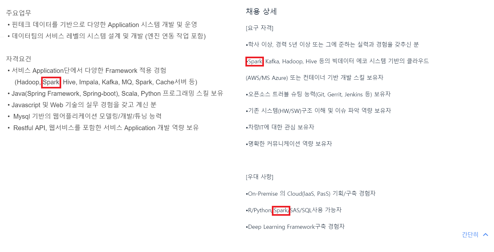
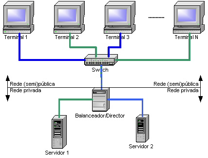
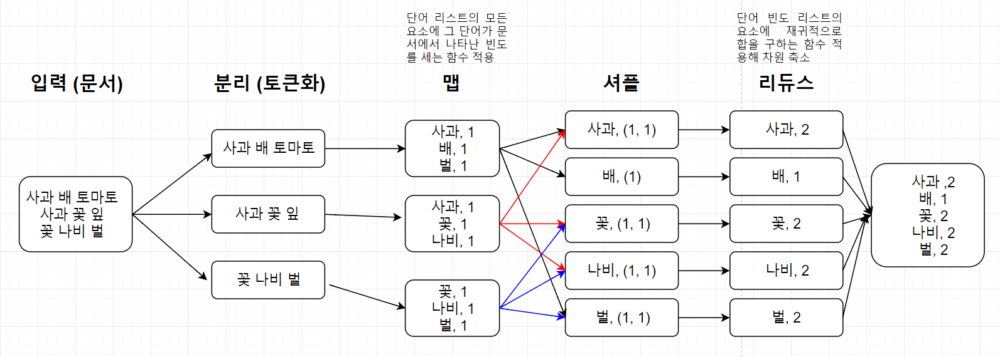

아래의 내용은 개인적으로 공부한 내용을 정리한 것입니다. 잘못된 내용이 있다면 댓글 부탁드립니다!

- - -
  
최근 빅데이터 시장에서의 스파크 (Spark)의 위상이 높아지고 있는 것으로 보입니다.  
채용 공고에서도 이전에 비해 스파크가 빈번하게 등장하는 것 같습니다.  





채용 공고에서 등장하는 스파크...!


대세에 따라 스파크 프로젝트를 진행해보고자 합니다.  
스파크 프로젝트를 진행하기 앞서 관련 기술 등을 검토해보고자 합니다.


아래의 정보는 
* T academy 토크ON세미나 9차 빅데이터 입문 Apache Spark
* Karau, H., Konwinski, A., Wendell, P. & Zaharia, M. (2015). 러닝 스파크: 번개같이 빠른 데이터 분석 (박종영 옮김). 경기:제이펍. (원서출판 2015). 


을 기반으로 작성되었습니다.  

## 컴퓨터 클러스터 (Computer cluster)[1][2]
하나의 시스템처럼 동작하는, 연결된 컴퓨터들의 집합을 뜻합니다.  
저렴한 마이크로프로세서, 고속의 네트워크 그리고 고성능 분산 컴퓨팅 소프트웨어의 조합으로 탄생했습니다. 이때 분산 컴퓨팅은 여러 컴퓨터의 처리 능력을 이용해 거대한 계산 문제를 해결하는 분산 처리 모델입니다.[3]  




각 컴퓨터 (Node, 노드)는 (주로 근거리 통신망을 이용해) 서로 통신하며 업무를 분담해 수행합니다. 이때 클러스터 미들웨어라는 소프트웨어 계층에서 노드들을 관리합니다.  
단일 컴퓨터에 비해, 
* 더 뛰어난 성능과 안정성을 제공합니다.
* 비율 측면에서 보다 효율적입니다.
  
## 맵 리듀스 (Map Reduce)[4]
클러스터에 빅데이터를 생성, 처리하는 병렬, 분산 알고리즘을 구현한 프로그래밍 모델을 의미합니다.  
함수형 프로그래밍의 Map 함수와 Reduce 함수를 조합해 사용합니다.  

Map 함수는 고차함수의 하나로, 인자로 주어진 함수를 자료 (배열, 시퀀스 컨테이너, 트리 컨테이너 등)의 각 요소에 적용해 반환하는 함수 (apply-to-all)입니다.[5]  
```
# Map function Python code example
# result = [2,4,6,8]

list(map(lambda x:x*2,[1,2,3,4]))

```
Reduce 함수는 고차함수의 하나로, fold, accumulate, aggregate, compress, inject라고도 불립니다.  
주어진 연산을 조합해 구성 요소를 재귀적으로 처리합니다. 예시를 보시면 이해가 보다 쉬울 것으로 생각됩니다.  
```
# Map function Python code example
# result = 10

from functools import reduce


reduce(lambda a, b: a+b, [1,2,3,4])
```
위의 예시에서 주어진 [1,2,3,4]를 차례로  
1 + 2  
(1+2) + 3
((1+2)+3) + 4  
를 해 10이라는 값을 얻었습니다.  
개인적으로는 Reduce 함수를 함수의 이름대로 데이터의 차원을 줄인다 (Reduce)라고 이해했습니다.   
1차원 배열이었던 [1,2,3,4]를 스칼라 (Scalar) 값으로 차원을 축소한 것으로 해석되기 때문입니다.  
올바른 이해인지는 좀더 확인이 필요할 것으로 보입니다. (아시는 분은 댓글 부탁드립니다!!)  

두 함수의 정의를 종합하면 모델의 전략을 이해하기 쉬울 것으로 보입니다.
맵 리듀스는 분할-적용-결합 전략 (split-apply-combine strategy)을 취합니다.  
이번에도 예시를 보면 보다 이해가 쉬울 것으로 생각됩니다. 설명을 위해 문서 내 단어의 수를 세는 예시를 이용하겠습니다.




### 함수 관련 용어 정리
고차함수
함수형 프로그래밍


## 스칼라 (Scala)
[1]: https://ko.wikipedia.org/wiki/%EC%BB%B4%ED%93%A8%ED%84%B0_%ED%81%B4%EB%9F%AC%EC%8A%A4%ED%84%B0
[2]: http://tigerbum.tistory.com/20
[3]: https://ko.wikipedia.org/wiki/%EB%B6%84%EC%82%B0_%EC%BB%B4%ED%93%A8%ED%8C%85
[4]: https://en.wikipedia.org/wiki/MapReduce
[5]: https://en.wikipedia.org/wiki/Map_(higher-order_function) 