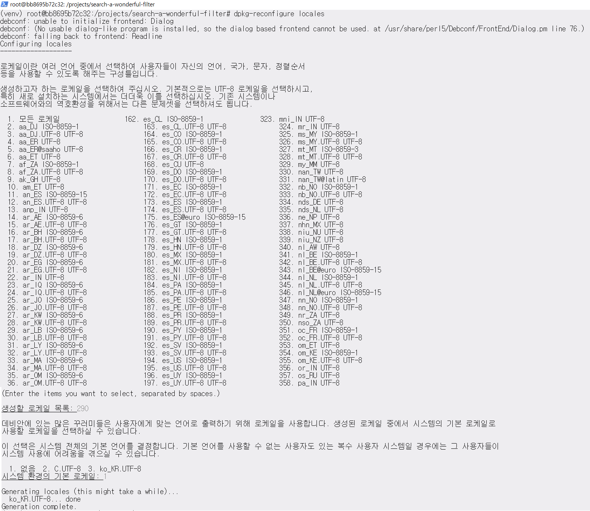
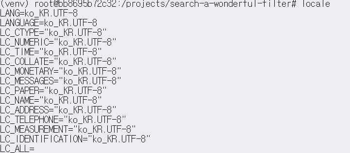

아래의 내용은 개인적으로 공부한 내용을 정리한 것입니다. 잘못된 내용이 있다면 댓글 부탁드립니다!

- - -

도커 우분투 컨테이너에서 웹 스크래핑 (Web scraping) 프로젝트를 진행하는데 계속 아래와 같은 에러 메시지가 표시되었습니다.

```
ascii codec can't encode characters in position 0-1 ordinal not in range(128)
```

처음엔 파이썬에서의 인코딩/디코딩 문제인 줄 알고 ```encode()```, ```decode()```를 이용했지만 동일한 문제가 발생했습니다.  
찾아보니 파이썬2.x에서는 기본 인코딩이 ```ascii```였으나, 파이썬3부터는 ```utf-8```으로 바뀌었다고 합니다.  
기본 인코딩이 ```utf-8```으로 바뀜에 따라 이가 문제가 되지 않는 것으로 보입니다.  
참고로 파이썬의 기본 인코딩 설정을 확인하기 위해서는 아래의 코드를 사용합니다.  

```
import sys


# get default encoding and print it
print(sys.getdefaultencoding())
```

이에 따라 호스트 운영체제인 윈도우에서도 동일 코드를 실행해보았습니다.  
실행 결과 윈도우에서는 문제 없이 코드가 작동하였습니다.  

다시 도커 우분투 컨테이너에 접속해 리눅스 ```locale``` 설정을 확인해보았는데 모든 값이 비어 있었습니다!  

이에 따라 [블로그](http://pragp.tistory.com/entry/Docker-%ED%95%9C%EA%B8%80-%EC%84%A4%EC%A0%95%ED%95%98%EA%B8%B0)에 따라 ```locale```을 설정했습니다.  


우선 패키지를 받기 전 

```
apt-get update
```

를 실행합니다.  
그리고 아래의 명령어를 사용해 ```locales``` 패키지를 설치합니다.

```
apt-get install locales
```

마지막으로 아래의 명령어들을 모두 입력해 설정을 마칩니다.

```
export LANGUAGE=ko_KR.UTF-8 
export LANG=ko_KR.UTF-8
locale-gen ko_KR ko_KR.UTF-8
update-locale LANG=ko_KR.UTF-8
dpkg-reconfigure locales
```

링크된 블로그에서는 나오지 않지만 ```dpkt-reconfigure locales``` 명령어를 실행하면,  
아래와 같이 생성할 로케일을 선택하고 시스템 전체의 기본 언어를 설정하는 화면이 나타납니다.




위와 같은 메시지가 나타나면, 화면을 참고해 생성할 로케일의 숫자를 입력함으로써 생성할 로케일을 선택합니다.  
그리고 안내되는 바와 같이 숫자를 입력해 시스템 전체의 기본 언어를 설정합니다.  
이를 완료하면, ```locale```명령어를 입력했을 때 아래와 같이 설정한 바가 표시됩니다!

