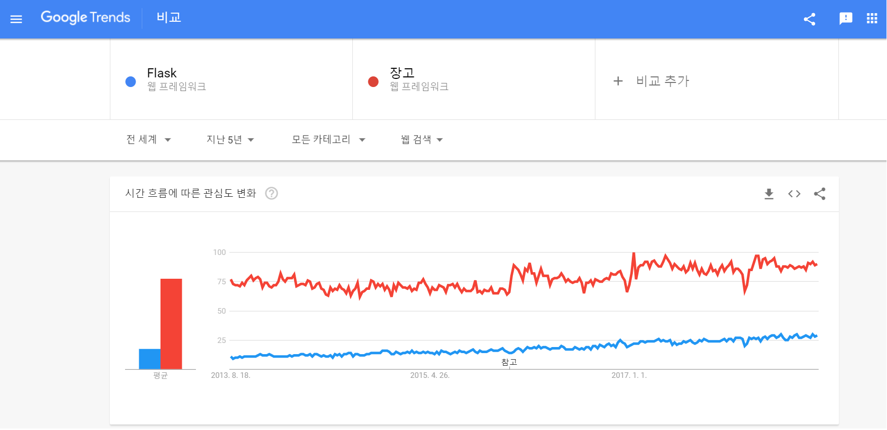
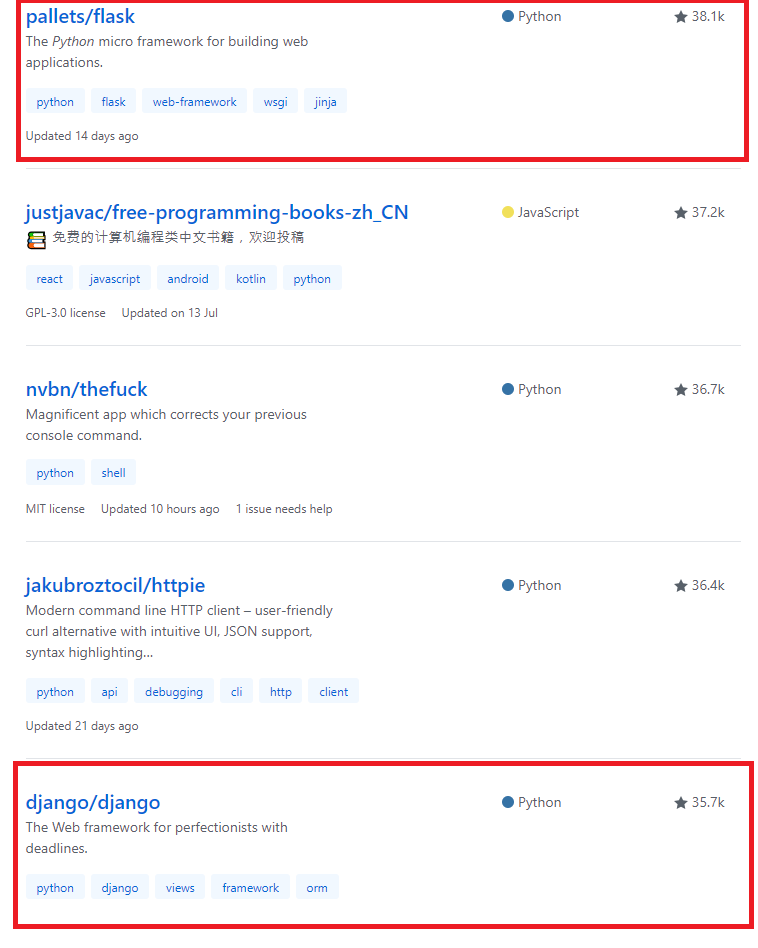
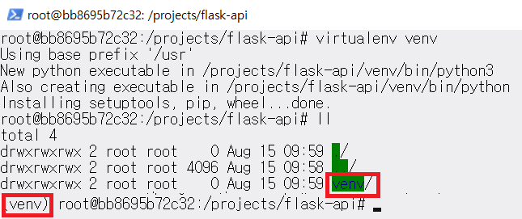
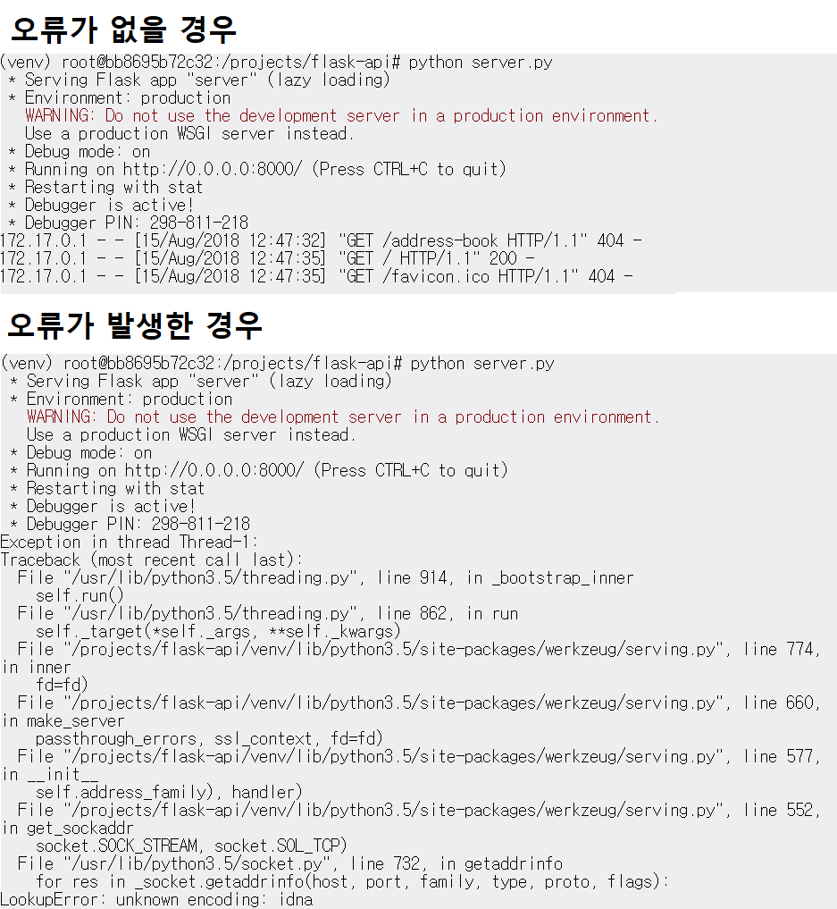
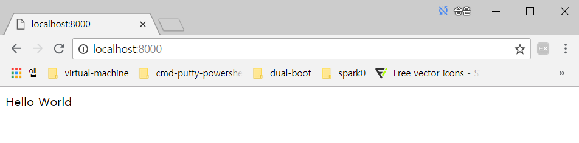

아래의 내용은 개인적으로 공부한 내용을 정리한 것입니다. 잘못된 내용이 있다면 댓글 부탁드립니다!

- - -

플라스크 (Flask) 파이썬 웹 프레임워크를 이용해 RESTful API 서버를 개발하고자 합니다.  
본 포스팅에서는 플라스크에 초점을 맞추고, RESTful API에 대해서는 [차후 포스팅](../web-api)에서 다루겠습니다.


우선 플라스크에 대해서 알아보고자 합니다.  
플라스크는 파이썬 웹 프레임워크 중 하나입니다. 다른 대표적인 파이썬 웹 프레임워크인 장고 (Django)와 비교함으로써 간략하게 더 설명드리고자 합니다.

## 플라스크 (Flask) vs 장고 (Django)[1][2][3]
* 플라스크 (Flask)
    마이크로 (Micro) 웹 프레임워크로, 핵심기능만 간결하게 유지하지만, 확장가능한 것을 목적으로 합니다.  
    플라스크의 장점은 간단하고 유연하다는 점입니다.
    아래의 구조를 관례로 하지만, 변경하여 사용해도 무방합니다.  
    ```
    /app
    \_ __init__.py # works as a controller, add controllers by function in big projects
    \__ /statics # stores javascript, css files
    \__ /templates # sotres html files
    ```
    링크드인 (Linkedin), 핀터레스트 (Pinterest, core application server로는 장고를 사용)가 플라스크를 사용한 대표적 서비스입니다.
* 쟝고 (Django)
    로렌스 저널-월드 (Lawrence Journal-World) 신문사의 웹 프로그래머 에이드리안 홀로바티 (Adrian Holovaty)와 사이먼 윌리슨 (Simon Willison)이 로렌스 웹사이트 구동을 위해 만든 파이썬 웹 프레임워크입니다.[4]    
    신문사의 웹사이트가 시작인 만큼 블로그 등의 사이트를 구축하기에 좋습니다.  
    기능이 많고 강력합니다. 일례로 장고는 플라스크와 달리 ORM 기능이 내장되어 있습니다.   
    장고를 사용한 대표적 서비스로 인스타그램 (Instagram), 핀터레스트 (Pinterest) 그리고 비트버킷 (Bitbucket)이 있습니다.
* 플라스크 vs 장고
       
    구글 트렌드로 본 플라스크 vs 장고입니다.  
    플라스크에 비해 장고가 더 많이 언급됨을 알 수 있는데요. 큰 커뮤니티가 장고의 장점이기도 합니다.   
      
    깃헙 (Github)에서 본 플라스크 vs 장고입니다.  
    깃헙 스타는 장고에 비해 플라스크가 많이 받았는데요.   
    두 프레임워크의 장점이 다른 만큼 상황에 맞게 프레임워크를 선택해 사용하면 될 것으로 보입니다!   

이제 본격적으로 플라스크로써 RESTfu API 서버를 만들고자 합니다.  
제 개발 환경은 아래와 같습니다.
* 우분투 도커 컨테이너
* 파이썬 3.5
* pip 8.1.1
* virtualenv 16.0.0
* 데이터베이스 SQLite 3.11.0

위의 사항 중에 누락된 항목이 있으실 경우 리눅스 터미널에서 아래의 코드를 이용해 필요한 항목의 설치를 완료해주세요.  
(도커의 설치 등은 [해당 포스팅](../run-linux-on-windows-03-docker)을 참고해주세요!)  
```
apt-get update

# install python3
apt-get install python3

# install pip3
apt-get install python3-pip

# install sqlite
apt-get install sqlite3 libsqlite3-dev

# install virtualenv
pip3 install virtualenv
```  

우선 프로젝트의 루트 디렉토리에서 ```virtualenv venv``` 명령어를 사용해 ```virtualenv```를 사용할 환경을 만들어줍니다.  
```virtualenv```는 독립적인 가상 파이썬 실행환경을 만들어줍니다. ```virtualenv```를 사용하면, 프로젝트별로 다른 파이썬 버전을 사용하거나 다른 패키지를 사용할 수 있습니다.[5]   
그 다음 ```source venv/bin/activate```명령어를 실행해 ```virtualenv```를 활성화해줍니다.  
  
위 명령어를 실행했을 때의 결과입니다. 두 번째 빨간 상자 안을 보면 ```virtualenv```가 실행되고 있음을 알 수 있습니다.   
이를 비활성화시키고 싶다면 ```deactivate``` 명령어를 사용하시면 됩니다.  

이제 ```pip install flask``` 명령어로 플라스크를 설치해줍니다.  
(```virtualenv``` 환경에서는 ```python3```와 ```pip3``` 대신 ```python```과 ```pip``` 명령어를 사용할 수 있습니다.)  
```pip list``` 명령어로 설치를 확인합니다.  

프로젝트 디렉토리에 ```server.py```파일을 만들어줍니다. ```server.py```의 내용은 아래와 같습니다.  
```server.py```는 일반적으로 ```__init__.py```로 명명하는 파일의 역할을 수행합니다.  
```
# server.py
# import flask module
from flask import Flask


# store in variable for convenience
app = Flask(__name__)

# if enter 'http://localhost:port-number', 'Hello World' appears
@app.route('/')
def index():
    return 'Hello World'

# run only when execute this file
# default port is '5000'
# port keyword argument is used when want to change default port
# debug keyword argument is used when develop
# do not need to restart server when debug is True
if __name__ == "__main__":
    app.run(host='0.0.0.0', port='8000', debug=True)
```

파일 작성을 완료하면 터미널에서 ```python server.py```명령어로 어플리케이션을 실행합니다.  
상태에 따라 아래와 같이 터미널에 결과가 출력됩니다.

  

이따금 원인을 알 수 없는 오류가 발생하는데, 이 경우는 어플리케이션을 재시작할 경우 동작합니다.  
추후 원인을 파악하면 포스팅하도록 하겠습니다!

  

브라우저에서 결과를 확인하면 위와 같습니다.  

이제 본격적으로 API 서버를 개발해보도록 하겠습니다. 게시판을 위한 RESTful API 서버를 만들어 볼 건데요!  

우선 데이터베이스를 편리하게 조작할 수 있도록 ```flask-sqlalchemy``` ORM 패키지를 사용할 예정입니다. ```pip install flask-sqlalchemy``` 명령어를 통해 해당 패키지를 설치해주세요!  

이제 ```flask-sqlalchemy```를 이용해 테이블을 만들겠습니다.  
```server.py```를 프로젝트 루트 디렉토리에 만들어 줍니다.  

```
# server.py
from datetime import datetime
from flask import (Flask, jsonify, request)
from flask_sqlalchemy import SQLAlchemy


app = Flask(__name__)
app.config.from_pyfile('config.cfg')
db = SQLAlchemy(app)


# SQLAlchemy Board Model
class Board(db.Model):
    __tablename__ = 'boards'
    id = db.Column(db.Integer, primary_key=True)
    author = db.Column(db.String)
    title = db.Column(db.String)
    content = db.Column(db.String)
    pub_date = db.Column(db.DateTime)

    def __init__(self, author, title, content):
        self.author = author
        self.title = title
        self.content = content
        self.pub_date = datetime.utcnow()

# create table based on model
db.create_all()
db.session.commit()
```
현재 프로젝트는 데이터베이스로 ```sqlite```를 사용하는데, 잠깐 ```sqlite```에서 데이터베이스를 만드는 작업과  ```Flask```에서 ```sqlite``` 데이터베이스 설정하는 방법에 대해서 언급하고자 합니다.  
위에서 언급한 ```apt-get install sqlite3 libsqlite3-dev``` 명령어를 통해 ```sqlite```를 설치했다면, 리눅스 또는 맥은 터미널에서 , 윈도우의 경우 cmd prompt 또는 Powershell에서 ```sqlite3```명령어를 이용해 ```sqlite``` 클라이언트 프로그램을 실행해주세요.   
그 다음 ```.open file-name.db```를 이용해 파일을 생성해주세요.  
위의 명령어를 실행하면, file-name 이름의 파일이 있다면 그 파일을 엽니다. file-name 이름의 파일이 없으면 해당 파일을 생성하고 엽니다.  
위의 ```server.py```에서 ```app.config.from_pyfile('config.cfg')``` 코드는 ```sqlite``` 설정을 다루는 파일을 이용하는 코드입니다. 위의 코드에서 사용하는 ```config.cfg```의 코드를 소개해드리고자 합니다. ```config.cfg```의 코드는 아래와 같습니다.  

```
# config.cfg
SQLALCHEMY_DATABASE_URI='sqlite:///board.db'
SQLALCHEMY_ECHO = False
SQLALCHEMY_TRACK_MODIFICATIONS = False
DEBUG = True
```
유의하셔야 할 점은 ```SQLACHEMY_DAtTABASE_URI```변수의 값을 할당할 때 ```mysql```의 경우 ```mysql://username:password@DB_IP/DB_NAMR```로 지정하지만, ```sqlite```의 경우 상대 경로는 ```sqlite:///```로, 절대 경로는 ```sqlite:////```로 경로를 지정해야 합니다.[6]  
```SQLALCHEMY_TRACK_MODIFICATIONS```의 경우 별도로 값을 설정하지 않는 경우 터미널 (윈도우의 경우 cmd prompt 또는 Powershell)에 오버헤드가 크다는 경고 메시지가 표시되므로 ```True``` 또는 ```False```로 값을 설정해주시길 바랍니다.  

이제 리눅스 또는 맥은 터미널에서, 윈도우의 경우 cmd prompt 또는 Powershell에서 ```python3 server.py```를 실행해주세요. 그럼 ```boards``` 테이블이 생성됩니다. 터미널 (윈도우의 경우 cmd prompt 또는 Powershell)에 아래의 명령어를 이용해 테이블을 확인해봅시다!  
```
# execute sqlite cient program
sqlite3

# open file
.open board.db

# check if table exits
.tables
``` 

테이블이 생성되었다면 ```boards```라고 결과가 출력됩니다.  
이제 server.py에 본격적으로 API 관련 코드를 작성해야 합니다. 이는 다음 포스트에 기술하도록 하겠습니다!

[1]: https://speakerdeck.com/nerogit/django-vs-flask-ggabobsida?slide=7
[2]: http://bluese05.tistory.com/44
[3]: https://flask-docs-kr.readthedocs.io/ko/latest/foreword.html#micro
[4]: https://ko.wikipedia.org/wiki/%EC%9E%A5%EA%B3%A0_(%EC%9B%B9_%ED%94%84%EB%A0%88%EC%9E%84%EC%9B%8C%ED%81%AC)
[5]: http://ulismoon.tistory.com/2
[6]: https://beomi.github.io/2017/10/20/DB-To-SQLAlchemy-Model/