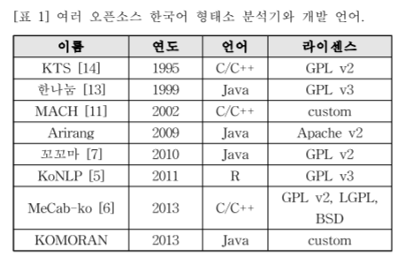
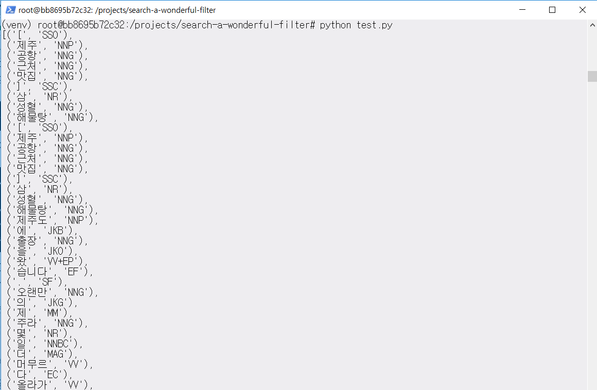

아래의 내용은 개인적으로 공부한 내용을 정리한 것입니다. 잘못된 내용이 있다면 댓글 부탁드립니다!

- - -

이전에 진행했던 프로젝트(프로젝트의 상세한 내용은 [여기](../selenium-web-scraper)를 참고해주세요!)의 리팩토링을 하며 파이썬의 대표적인 한국어 자연어 처리 라이브러리 KoNLPy를 사용하게 되었습니다.  

- - -
### 자연어 처리 (Natural Language Processing, NLP)
사람들이 사용하는 언어를 컴퓨터는 이해하지 못합니다. 컴퓨터는 디지털 신호 (**0**과 **1**)로써 정보를 인식하기 때문입니다. 따라서 사람들이 사용하는 언어를 컴퓨터에게 올바르게 인식시키기 위해서는 별도의 처리를 요구합니다. 이를 자연어 처리 (Natural Language Processing, NLP)라고 합니다.  

자연어 처리에는 형태소 분석, 품사 부착, 구절 단위 분석, 구문 분석 등이 포함됩니다.[2]  

형태소 분석은 의미의 최소 단위인 형태소로 대상 텍스트를 분리하는 것을 뜻합니다. 자연어 처리의 기본이 됩니다. 오탈자, 띄어쓰기 등이 형태소 분석의 정확도에 영향을 미치는 요인입니다.  

품사 부착은 형태소 분석 결과 중 가장 적합한 형태의 품사를 부착하는 것을 뜻합니다.  

구절 단위 분석은 형태소의 집합인 구와 단문 단위인 절을 단위로 텍스트를 분석하는 것을 의미합니다.  

마지막으로 구문 분석은 문장을 그 구성 성분으로 분해하고 그 간의 위계 관계를 분석해 문장 구조를 결정하는 것을 뜻합니다.[3]

- - -

KoNLPy는 현존하는 도구에 한 층을 쌓아 더 멀리 보려는 목적을 가지고 만들어졌습니다.[1] 이런 목적에 따라 만들어진 KoNLPy를 사용하면 다양한 한국어 자연어 처리 도구를 간편하게 사용할 수 있습니다.  

 


*박은정 & 조성준. (2014). KoNLPy: 쉽고 간결한 한국어 정보처리 파이썬 패키지. 제 26회 한글 및 한국어 정보처리 학술대회 논문집.*에서 소개하고 있는 한국어 자연어 처리 라이브러리 현황입니다. 이외에도 [이곳](https://github.com/krikit/hanal/wiki/%ED%95%9C%EA%B5%AD%EC%96%B4-%ED%98%95%ED%83%9C%EC%86%8C-%EB%B6%84%EC%84%9D%EA%B8%B0-%EB%8F%99%ED%96%A5)에서 한국어 자연어 처리 라이브러리에 대한 정보를 얻을 수 있습니다.  

KoNLPy의 도큐멘테이션 페이지에 접속하시면 KoNLPy에 탑재된 현존 한국 자연어 처리 라이브러리의 [성능을 비교한 결과](https://konlpy-ko.readthedocs.io/ko/v0.4.3/morph/#comparison-between-pos-tagging-classes)가 나타나 있습니다.  

이에 따르면 KoNLPy의 여러 클래스 중 Mecab 클래스가 
* 단어가 증가함에 따라 속도 증가 폭이 작습니다.
* 띄어쓰기가 안 된 문장도 비교적 정확하게 품사를 태깅합니다.
* 동일한 형태가 문장 안에서 다른 의미로 사용되었을 때 (*"나는 밥을 먹는다"* vs *"하늘을 나는 자동차"*) 단어의 의미와 주변부를 살피어 정확하게 품사를 태깅합니다. 
* 신조어 등 사전에 포함되지 않는 단어를 정확하게 품사 태깅합니다.  

- - -
### Mecab[4]
나라 첨단과학기술대학원대학 (Nara Institute of Science and Technology)에서 일본어 처리를 목적으로 개발한, 오픈소스인 텍스트 세그먼트 (text segment) 라이브러리입니다.  
KoNLPy의 Mecab 클래스는 은전한닢 프로젝트의 wrapper (다른 프로그램이 성공적으로 실행될 수 있도록 해주는 프로그램이나 스크립트를 의미)입니다.[5] 은전한닢 프로젝트는 Mecab과 21세기 세종 계획의 성과물을 이용해, 검색에서 쓸만한 오픈소스 한국어 형태소 분석기를 만드는 것을 목적으로 하고 있습니다.[6]  
- - -

기존 프로젝트에서는 Komoran을 형태소 분석기로서 사용했지만, 위의 장점에 따라 리팩토링 프로젝트에는 Mecab을 사용하기로 결정했습니다.  

KoNLPy에서 Mecab을 사용하기 위해서는 몇 가지의 작업이 필요합니다. 본 포스팅에서는 이에 대해 다루고자 합니다.[7]

* MeCab 설치  
    현재 저는 윈도우 머신 위에서 동작하는 우부툰 도커 컨테이너에서 작업을 진행하고 있습니다! 우분투에서 Mecab을 사용하기 위해 설치를 진행합니다. 참고로 KoNLPy의 Mecab 클래스는 윈도우에서 지원되지 않습니다. 우분투에서 MeCab을 설치하는 명령어는 다음과 같습니다.
    ```
    # install curl if curl is not installed
    apt-get install curl

    # install MeCab using curl
    bash <(curl -s https://raw.githubusercontent.com/konlpy/konlpy/master/scripts/mecab.sh)
    ```
    ```curl```은 서버 간 데이터를 전송하는 툴입니다. ```curl```은 아래의 프로토콜 중 하나를 사용합니다.[10]
    * DICT
    * FILE
    * FTP
    * FTPS
    * GOPHER
    * HTTP
    * HTTPS
    * IMAP
    * IMAPS
    * LDAP
    * LDAPS
    * POP3
    * POP3S
    * RTMP
    * RTSP 
    * SCP 
    * SFTP 
    * SMB 
    * SMBS 
    * SMTP 
    * SMTPS 
    * TELNET
    * TFTP

* mecab-ko 설치  
    mecab-ko는 Mecab의 포크 (fork, 레파지토리의 복사본으로, 이를 이용할 경우 원래 레파지토리에 영향을 주지 않고 변경해볼 수 있음) 프로젝트로, 최소한의 변경만으로 한국어 특성에 맞는 기능을 추가하는 것을 목표로 합니다.[9]   
    아래의 명령어를 실행하면, mecab-ko를 설치할 수 있습니다.  
    ```
    # download file using wget
    wget -c https://bitbucket.org/eunjeon/mecab-ko/downloads/mecab-0.996-ko-version.tar.gz

    # upzip tar
    tar zxfv mecab-0.996-ko-version.tar.gz

    # chage directory to unzipped mecab-ko
    cd mecab-0.996-ko-version

    # allow to use command line option, execute configure in this directory
    ./configure

    # build executable programs and libraries from source code
    make

    # perform self tests 
    make check

    # copy complied files into appropriate locations
    make install 
    ```
    주석을 통해 간략히 설명해두었지만, make는 조금 더 설명이 필요할 듯하여 링크를 남깁니다! make와 관련된 내용은 아래의 링크들을 참고해주세요.  
    [make 명렁어의 역할](https://www.computerhope.com/unix/umake.htm), [make check 명령어의 역할](https://stackoverflow.com/questions/1735473/what-does-make-check-do), [make install의 역할](https://superuser.com/questions/360178/what-does-make-install-do)  
    추가적으로 wget에 대한 설명은 [이 포스팅](../selenium-web-scraper)에서 언급하고 있습니다!

* mecab-ko-dic 설치  
    mecab-ko 설치를 완료했다면, 이제 mecab-ko-dic을 설치할 차례입니다. mecab-ko-dic은 Mecab를 이용해 한국어 형태소 분석을 하기 위한 프로젝트입니다. 설치 과정은 위의 mecab-ko와 비슷합니다.
    ```
    # download file using wget
    wget -c https://bitbucket.org/eunjeon/mecab-ko-dic/downloads/mecab-ko-dic-version.tar.gz

    # upzip tar
    tar zxfv  mecab-ko-dic-version.tar.gz

    # chage directory to unzipped mecab-ko-dic     
    cd mecab-ko-dic-version

    # allow to use command line option, execute configure in this directory
    ./configure

    # build executable programs and libraries from source code
    make

    # perform self tests 
    make check

    #  copy complied files into appropriate locations
    make install
    ```


위의 설치를 완료해주셔도 Java가 설치되지 않은 경우 ```Exception: Install MeCab in order to use it: http://konlpy.org/en/latest/install/``` 메시지가 등장할 수 있습니다. 그러니 품사 태깅 전 꼭 Java를 설치해주시길 바랍니다!  
도커 우분투 컨테이너를 기준으로 Java를 설치하는 법은 아래와 같습니다.[11]    
```
sudo apt-get install default-jre
sudo apt-get install default-jdk
```


여기까지 완료하면 이제 KoNLPy의 Mecab을 이용해 품사 태깅이 가능합니다. KoNLPy의 Mecab 클래스를 이용한 품사 태깅 결과는 아래와 같습니다!


 
[1]: https://konlpy-ko.readthedocs.io/ko/v0.4.3/
[2]: https://ko.wikipedia.org/wiki/%EC%9E%90%EC%97%B0_%EC%96%B8%EC%96%B4_%EC%B2%98%EB%A6%AC
[3]: https://ko.wikipedia.org/wiki/%EA%B5%AC%EB%AC%B8_%EB%B6%84%EC%84%9D
[4]: https://en.wikipedia.org/wiki/MeCab
[5]: https://searchmicroservices.techtarget.com/definition/wrapper, http://www.terms.co.kr/wrapper.htm
[6]: http://eunjeon.blogspot.com/2013/02/blog-post.html
[7]: https://calyfactory.github.io/mecab%EC%9D%98-custom-dictionary%EC%99%80-konlpy-%EC%97%B0%EB%8F%99%ED%95%98%EA%B8%B0/
[8]: https://stackoverflow.com/questions/24939843/what-does-it-mean-to-fork-on-github
[9]: https://bitbucket.org/eunjeon/mecab-ko/src/master/README.md
[10]: https://curl.haxx.se/docs/manpage.html
[11]: https://www.digitalocean.com/community/tutorials/how-to-install-java-with-apt-get-on-ubuntu-16-04