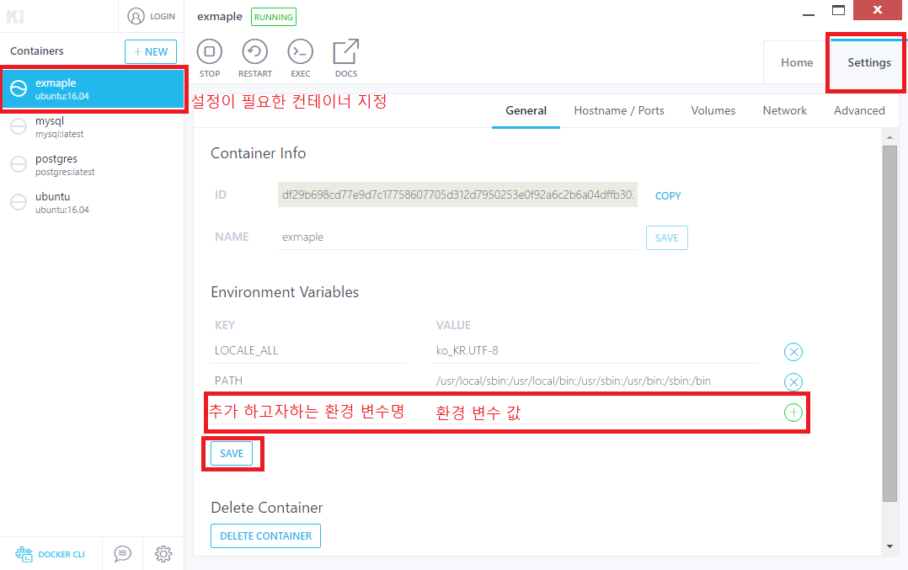

아래의 내용은 개인적으로 공부한 내용을 정리한 것입니다. 잘못된 내용이 있다면 댓글 부탁드립니다!

- - -

[지난 포스팅](../how-to-write-read-korean-in-docker-ubuntu-terminal-01)에서 도커 우분투 컨테이너 터미널에서의 한글 입출력에 대해 다루었는데요! 위 포스팅의 방법으로 문제를 해결한 후 도커에 재접속하니 동일한 문제가 다시 발생하였습니다.  

```
export LANGUAGE=ko_KR.UTF-8 
export LANG=ko_KR.UTF-8
```
지난 번에 시도했던 방법이 위의 명령어로써 리눅스 환경 변수를 설정해 터미널에서의 인코딩 / 디코딩을 지정해주는 방식이었는데, 도커에 재접속하면 환경 변수가 초기화되어 문제가 발생하는 것으로 파악되었습니다.  

이 문제를 해결해주기 위해서는 **도커를 실행할 때** 리눅스 우분투 환경 변수를 설정해주어야 합니다. 본 포스팅에서는 이에 대해 다루고자 합니다. 단 포트 재설정과 마찬가지로 환경 변수 재설정은 새로이 도커 컨테이너를 실행하는 것이기 때문에, *이전에 사용했던 도커 컨테이너에 새로운 환경 변수를 추가하면 해당 컨테이너를 삭제하고 새로운 설정대로 도커 컨테이너를 실행하는 효과*가 있으므로 유의해주시길 바랍니다!  

* CLI 환경에서 도커 우분투 컨테이너 환경 변수 지정

    CLI 환경에서 환경 변수를 설정하는 방법은 아래와 같습니다. (아래의 명령어는 관련 내용을 다루기 위한 최소한의 옵션을 포함하고 있습니다. 기타 옵션에 대한 자세한 내용은 [도커를 다루고 있는 포스팅](../run-linux-on-windows-03-docker)을 참고해주시길 바랍니다!)
    ```
    docker run -it -e ENVIRONMENT_VARIABLE_NAME=environment_variable_value --name ubuntu-container-name ubuntu:tag
    ```
    예상하실 수 있는 바와 같이 ```-e``` (또는 ```--env```)는 환경 변수를 설정하는 옵션으로, 옵션 다음에 공백 한 칸 입력 후 ```설정하고자 하는 환경 변수명=환경 변수의 값```의 형식으로 환경 변수를 지정하실 수 있습니다. 여러 환경 변수를 설정하고 싶으시다면 ```-e```이하를 반복하여 사용해주시면 됩니다.[1]

* GUI 환경에서 도커 우분투 컨테이너 환경 변수 지정
    Docker Kitematic을 이용하시면 GUI 환경에서 도커 관련 설정을 진행하실 수 있습니다.  
    구체적인 방법은 Docker Kitematics 실행 후 아래의 그림을 참고해주세요!  
      

환경 변수 지정시 유의해야 하는 점은 ```LC_ALL``` 환경 변수 값이 없을 경우 아래와 같이 파이썬 패키지 관리를 하는 ```pip``` 명령 수행 시 문제가 발생할 수 있다는 점입니다. 도커 우분투 컨테이너에서 파이썬, 특히 ```pip```를 사용하신다면 ```LC_ALL``` 설정을 해주시길 바랍니다.  


이제 환경 변수를 지정한 이후 해야 하는 과정에 대해 다루고자 합니다. 

우선 설정이 잘 되었는지 확인하기 위해서는 ```locale```명령어를 사용해야 합니다. 이를 사용하기 위해 아래의 명령어를 이용해 필요한 패키지를 설치합니다.
```
# use this command line if it is necessary
apt-get update

apt-get install -y locales
```

설치가 완료되었다면 ```locale``` 명령어를 이용해 설정을 확인합니다. 본 포스팅의 내용과 동일한 절차를 거치셨다면 아래와 같은 결과를 보게 되실 겁니다.  


상단에 해당 파일이나 디렉토리를 찾을 수 없어 locale을 지정할 수 없다는 결과가 나옵니다. 이때 ```/etc```의 구조를 살펴보시면 아래와 같습니다.  

  

이제 [이전 포스팅](../how-to-write-read-korean-in-docker-ubuntu-terminal-01)에서 다루었던 명령어를 실행해줍니다. 명령어는 다음과 같습니다.
```
dpkg-reconfigure locales
```

이전에 언급 드린 바와 같이 생성할 로케일의 번호를 입력하고, 기본 로케일을 지정해 설정을 마칩니다. 이 과정을 마치셨다면, 이제 ```/etc``` 디렉토리에 아래와 같이 ```locale.gen```과 ```locale.alias``` 파일이 생성된 것을 확인하실 수 있습니다.


```locale.gen``` 파일을 ```vim``` 편집기를 이용해 열어 보시면 지정한 인코딩인 ```ko_KR.UTF-8```을 제외하고 모든 인코딩 방식에 주석이 걸려 있는 것을 확인하실 수 있습니다.


앞에서  ```locale``` 명령어 실행 시 파일이나 디렉토리를 찾을 수 없다는 결과는 이들 파일이 누락되어 발생함을 알 수 있습니다. 이제 ```locale``` 명령어를 실행해도 위와 같은 메시지가 더이상 표시되지 않습니다!


모든 설정이 완료되었습니다. 이제는 도커에 재접속해도 인코딩 / 디코딩 설정이 유지되는 것을 확인하실 수 있습니다!  


[1]: https://stackoverflow.com/questions/30494050/how-do-i-pass-environment-variables-to-docker-containers