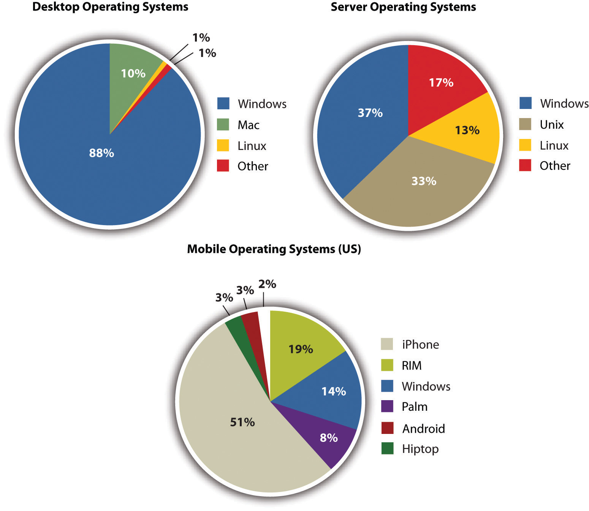
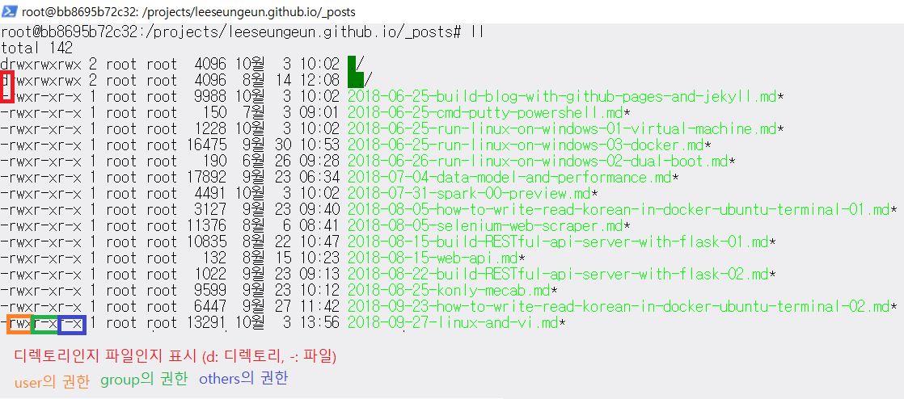
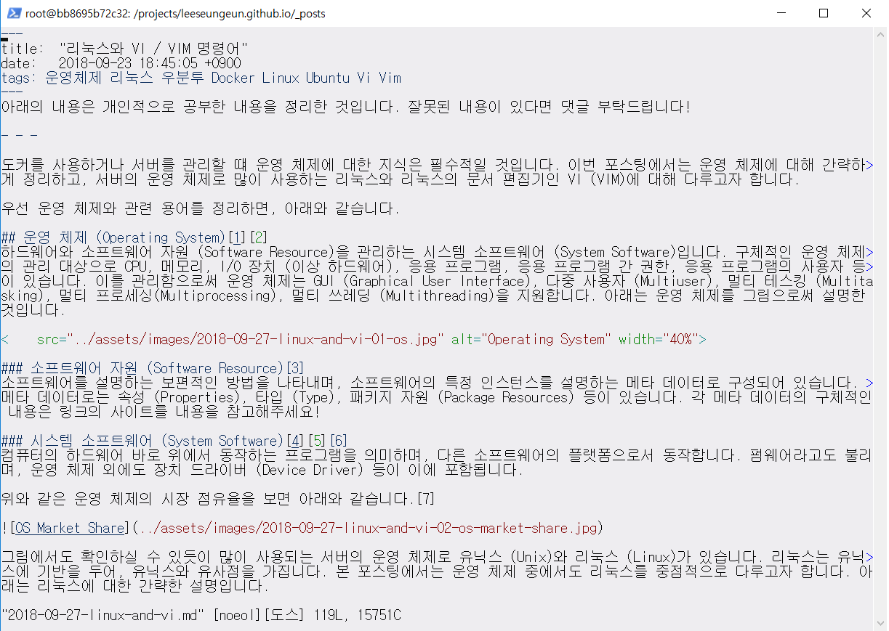
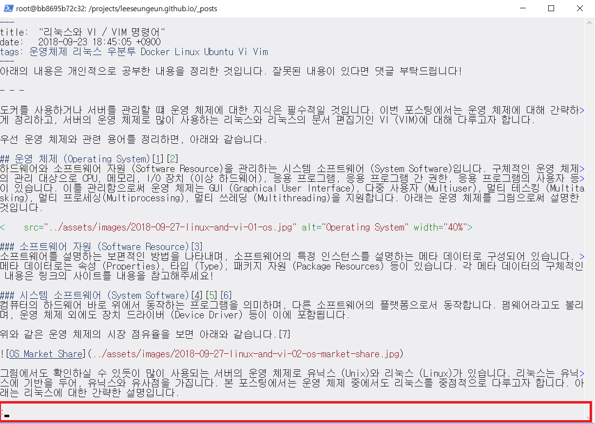

아래의 내용은 개인적으로 공부한 내용을 정리한 것입니다. 잘못된 내용이 있다면 댓글 부탁드립니다!

- - -

도커를 사용하거나 서버를 관리할 떄 운영 체제에 대한 지식은 필수적일 것입니다. 이번 포스팅에서는 운영 체제에 대해 간략하게 정리하고, 서버의 운영 체제로 많이 사용하는 리눅스와 리눅스의 문서 편집기인 VI (VIM)에 대해 다루고자 합니다.  

우선 운영 체제와 관련 용어를 정리하면, 아래와 같습니다.  

## 운영 체제 (Operating System)[1][2]
하드웨어와 소프트웨어 자원 (Software Resource)을 관리하는 시스템 소프트웨어 (System Software)입니다. 구체적인 운영 체제의 관리 대상으로 CPU, 메모리, I/O 장치 (이상 하드웨어), 응용 프로그램, 응용 프로그램 간 권한, 응용 프로그램의 사용자 등이 있습니다. 이를 관리함으로써 운영 체제는 GUI (Graphical User Interface), 다중 사용자 (Multiuser), 멀티 테스킹 (Multitasking), 멀티 프로세싱(Multiprocessing), 멀티 쓰레딩 (Multithreading)을 지원합니다. 아래는 운영 체제를 그림으로써 설명한 것입니다.


### 소프트웨어 자원 (Software Resource)[3]
소프트웨어를 설명하는 보편적인 방법을 나타내며, 소프트웨어의 특정 인스턴스를 설명하는 메타 데이터로 구성되어 있습니다. 메타 데이터로는 속성 (Properties), 타입 (Type), 패키지 자원 (Package Resources) 등이 있습니다. 각 메타 데이터의 구체적인 내용은 링크의 사이트를 내용을 참고해주세요!

### 시스템 소프트웨어 (System Software)[4][5][6]
컴퓨터의 하드웨어 바로 위에서 동작하는 프로그램을 의미하며, 다른 소프트웨어의 플랫폼으로서 동작합니다. 펌웨어라고도 불리며, 운영 체제 외에도 장치 드라이버 (Device Driver) 등이 이에 포함됩니다. 

위와 같은 운영 체제의 시장 점유율을 보면 아래와 같습니다.[7]



그림에서도 확인하실 수 있듯이 많이 사용되는 서버의 운영 체제로 유닉스 (Unix)와 리눅스 (Linux)가 있습니다. 리눅스는 유닉스에 기반을 두어, 유닉스와 유사점을 가집니다. 본 포스팅에서는 운영 체제 중에서도 리눅스를 중점적으로 다루고자 합니다. 아래는 리눅스에 대한 간략한 설명입니다.

## 리눅스[8][9][10]
다중 사용자, 멀티 테스킹과 멀티 스레딩을 지원하는 네트워크 운영 체제의 커널을 의미합니다. 리누스 토르발스 (Linus Torvalds) 주체로 개발되었으며, 교육용 유닉스인 미닉스 (Minix)를 기반으로 만들어졌습니다. 리눅스는 엄밀한 의미에서 커널만을 지칭하지만, GNU 프로젝트 라이브러리와 도구들이 포함된 전체 운영 체제 (GNU/리눅스, 리눅스 배포판)를 지칭할 때에도 흔하게 사용됩니다. 자유 소프트웨어와 오픈 소스 개발의 표본입니다. 리눅스 배포판으로는 우분투, CentOS 등이 있습니다.

### GNU[11]
운영 체제이자 컴퓨터 소프트웨어의 모음으로, 리처드 스톨먼 (Richard Stallman)에 의해 시작되었습니다. GNU는 *GNU's Not Unix*의 재귀 약자입니다. 이는 유닉스 계열이지만, 자유 소프트웨어인 점과 유닉스 코드를 포함하지 않는다는 점을 강조하지 위함입니다. GNU HURD를 커널로서 포함하고 있습니다. 하지만 GNU HURD는 아직 운영용으로 준비되지 않아, 리눅스 커널과 결합해 많이 사용됩니다.   

운영 체제의 서비스에 사용자가 접근할 수 있도록 인터페이스를 제공해주는 프로그램을 셸이라고 합니다.[12][13] 리눅스는 bash라는 셸을 사용하고 있는데, 이에 대한 명령어를 배움으로써 리눅스 기본 명령어에 대해 설명 드리고자 합니다.

가장 먼저 알려드릴 부분은 명령어를 사용 시 빈번하게 사용하실 자동 완성 기능입니다. ```tab``` 키를 누르면 자동으로 명령어 / 파일명 / 디렉토리 등이 완성됩니다. 입력한 부분과 패턴이 일치하는 명령어 / 파일명 / 디렉토리 등이 다수 존재하는 경우 이들 목록을 출력해줍니다.

그 다음은 패키지 관련 명령어를 정리하고자 합니다.  

### 리눅스 패키지[14]
C 언어 등으로 작성된 프로그램은 텍스트 파일로, 컴파일러, 어셈블러, 링커를 통해 빌드해야 실행 파일이 생성됩니다. 이렇게 생성된 실행 파일은 라이브러리에 따라 다르게 빌드되는데, 오픈 소스로 개발되는 리눅스 특성 상 의존하는 라이브러리의 버전이 달라 빌드된 실행 파일만으로는 실행을 보장하지 않습니다. 이에 따라 커널 및 라이브러리 버전의 배포 환경에 맞추한 빌드한 실행 파일을 압축한 패키지 개념이 등장하였습니다.   
패키지 방식은 레드햇 계열의 rpm과 데비안 계열의 deb 등이 있습니다. 패키지 관리 명령어는 패키지 방식에 따라 차이가 있습니다. rpm 패키지 방식은 ```yum``` 명령어를 , deb 패키지 방식은 ```apt-get``` 명령어를 사용합니다.   
이 명령어를 사용하기 위해서는 관리자 권한이 필요합니다. 이때 필요한 명령어가 ```sudo``` 또는 ```su```입니다.    ```sudo```는 사용자 전환 없이 현재 사용자에서 다른 사용자의 권한만을 빌려오는 명령어입니다. ```sudo yum ...``` 또는 ```sudo apt-get ...``` 형식으로 사용하시면 됩니다.[15]   
```su```는 사용자를 전환할 때 사용하는 명령어입니다. ```substitute user```의 줄임말로, 변경하고자 하는 사용자를 인자로 주는데 이를 생략할 경우 ```su root```와 같이 작동합니다.[16]       

아래는 패키지 관련 명령어를 정리한 표입니다.  

명령어|기능
------|-----
(rpm) yum list <br/> (deb) dpkg -l | 설치된 패키지를 확인하는 명령어입니다. <br/> 한 프로세스의 출력 스트림이 또다른 프로세스의 입력 스트림으로 사용돌 때 쓰는 파이프(pipe) ```|``` 명령어[8], 그리고 각 파일 또는 표준 입출력에서 일치하는 패턴을 찾아주는 ```grep``` 명령어와 함께 사용할 경우 특정 패키지가 설치되었는지 여부를 확인할 수 있습니다. <br/> 사용 예시는 ```yum list | grep package-name``` 또는 ```dpkg -l | grep package-name```과 같습니다. <br/> 위의 명령어와 비슷한 기능한 명령어로는 프로그램 설치 여부를 알려주는 ```which```와 ```whereis``` 명령어가 있습니다. ```which program-name``` 또는 ```whereis program-name```을 사용하시면, 프로그램이 설치되어 있을 경우 설치된 위치를 출력하고, 설치되지 않았을 경우에는 아무것도 출력하지 않습니다.
yum \| apt-get update|패키지 목록을 새로 가져옵니다.
yum \| apt-get upgrade|현재 목록의 패키지를 최신 버전으로 수정해줍니다. 
yum \| apt-get install package-name|package-name의 패키지 설치해줍니다. <br/> ```-y``` 옵션과 함께 많이 사용됩니다. ```-y``` 옵션은 응답에 예 (yes)라고 응답하는 옵션으로, 패키지 설치를 위해 저장 공간 확보 여부를 물을 때 등에 자동으로 응답해 설치를 진행해줍니다.
yum \| apt-get remove package-name|package-name의 패키지를 삭제해줍니다. 

아래는 디렉토리 및 파일과 관련하여 자주 쓰이는 명령어의 목록입니다. 아래 명령어를 사용할 때 ```~```은 home 디렉토리를, ```/```는 root 디렉토리를 의미합니다.

명령어|기능
-----|-----
```pwd```|```print working directory```의 약자로 현재 디렉토리를 출력해줍니다.
```cd```|```change directory```의 약자로 다른 디렉토리로 이동할 때 사용하는 명령어입니다. <br/> ```cd directory``` 형태로 사용하며, ```directory```자리에 파일이 올 경우 ```Not a directory```라는 메시지가 표시됩니다. 
```ls```|현재 디렉토리의 하위 디렉토리와 파일을 표시해줍니다. <br/> ```-l``` 옵션, ```-a``` 옵션과 함께 자주 사용됩니다. <br/> ```-l``` 옵션은 long listing format으로 디렉토리인지 여부, 권한, 하드 링크의 수, 소유자와 그 그룹, 생성 /  수정일, 크기, 이름을 표시해줍니다.[17] <br/> ```-a``` 옵션은 숨김 파일까지 표시해줍니다. <br/> ```/home/user_name/.bashrc``` 또는 ```/etc/bashrc```에 alias를 등록하면 ```ll``` 명령어로써 ```ls -al```명령을 사용할 수 있게 됩니다.[18]<br/> 인자를 생략할 경우 현재 디렉토리에 대한 정보를 얻을 수 있지만, ```ls -options some_directory_or_file``` 형태로 사용할 경우 특정 하위 디렉토리 또는 파일을 지정해 그 정보를 볼 수 있습니다.  
```mkdir```|```make directory```의 약자로 디렉토리 생성 시 사용합니다. ```mkdir directory_name``` 형태로 사용합니다.
```rmdir```|```remove directory```의 약자로 디렉토리 삭제 시 사용합니다. <br/> ```rmdir directory_name``` 형태로 사용하며, 해당 디렉토리가 존재하지 않을 경우 ```No such file or directory```라는 메시지가 표시됩니다. <br/> <b>단, 지우고자 하는 디렉토리가 비어있지 않을 경우에는 이 명령어를 사용할 수 없습니다.</b>
```touch```|```touch path/file_name.extension``` 형태로 사용하며, file_name을 이름으로 가지는 파일을 생성합니다.
```rm```|```remove```의 약자로 파일 또는 디렉토리를 삭제할 때 사용합니다. <br/> 빈번하게 같이 사용하는 옵션으로는 ```-f```와 ```-r```이 있습니다. <br/> ```-f``` 옵션은 ```--force``` 옵션으로 옵션의 이름대로 **강제로** 파일을 삭제합니다. 이 옵션을 사용할 경우 중요한 파일이 삭제될 수 있기 때문에 사용 시에 유의해야 합니다. <br/> ```-r``` 옵션은 ```--recursive```옵션으로 디렉토리와 그 안의 컨텐츠를 삭제합니다. ```rmdir``` 명령어 사용 시 디렉토리에 파일이 존재할 경우 해당 명령어를 사용할 수 없었는데, 이와 같은 경우 ```rm -r directort-name``` 명령어를 사용하시면 됩니다.
```cat```|파일의 내용을 확인할 때 사용하는 명령어입니다.
```head```|파일의 앞 부분만을 확인할 때 사용하는 명령어입니다.
```tail```|파일의 뒷 부분만을 확인할 때 사용하는 명령어입니다.
```more```|파일의 내용을 확인할 때 사용하는 명령어입니다. <br/> 화면이 넘어가지 않는 정도의 내용만 표시해주며, 그 이상의 내용은 ```Enter```키 (한 줄 단위로 화면 이하 내용 표시) 또는 ```space``` 키 (한 페이지 단위로 화면 이하 내용 표시)로 확인 가능합니다.
```cp```|파일 또는 디렉토리를 복사할 때 사용하는 명령어입니다. <br/> ```cp source destination```형태로 사용하며, ```-r``` (```--recursive```) 옵션을 사용할 경우 디렉토리와 하위 내용들까지 복사해줍니다.
```mv```|파일을 다른 디렉토리로 옮길 때 사용하는 명령어입니다. <br/> ```mv source destination``` 형태로 사용합니다.
```ln -s```|심볼릭 링크를 생성하는 명령어입니다. <br/> 심볼릭 링크는 소프트 링크라고도 하며, 다른 파일 (또는 디렉토리)을 가리키는 특별한 종류의 파일 (또는 디렉토리)입니다. (윈도우의 바로가기 (shortcut)나 맥의 별칭 (alias)과 같은 역할을 수행합니다.)[19] <br/> ```ln -s file-name link-name```의 형식으로 사용합니다.



위의 그림은 ```ls -l``` 명령어 사용 시 나오는 결과입니다. 위 그림에서 파일의 경우 ```r```은 ```read``` (읽기) 권한, ```w```는 ```write``` (쓰기) 권한, ```x```는 ```execute``` (실행) 권한을 의미하며, 디렉토리의 경우 ```r```은 ```cd``` 명령어 사용 가능 여부, ```w```는 파일 추가 / 삭제 가능 여부, ```x```는 ```ls``` 명령어 사용 가능 여부를 의미합니다.

이때 같이 같이 알아두시면 좋은 사항이 권한의 8진 표기법입니다. ```r``` 권한은 4, ```w``` 권한은 2, ```x``` 권한은 1로 7은 모든 권한을 부여함을 의미합니다. 권한을 변경하는 명령어인 ```chmod```와 함께 자주 쓰이며, ```chmod 755 file-name```과 같은 형식으로 사용합니다. 이떄 세 개의 권한은 순서대로 7=user, 5=group, 5=others의 권한을 의미합니다.  
```chmod```와 같이 알아두시면 좋은 명령어로 ```chown```과 ```chgrp``` 명령어가 있습니다. 각각 소유자와 그룹을 바꾸는 명령어로, root 또는 원소유자만 사용할 수 있습니다. ```chown file-name new-owner``` 또는 ```chgrp file-name new-group```의 형태로 사용합니다.

리눅스는 다중 사용자를 지원하는 운영 체제로, 마지막으로는 사용자와 관련된 명령어 모음을 다루도록 하겠습니다. 위에서 언급한 ```sudo```와 ```su``` 명령어는 생략하겠습니다.  

명령어|기능
------|----
whoami|로그인한 사용자의 이름을 출력해줍니다.
passwd|이 명령어를 사용할 시 로그인한 사용자의 비밀번호를 변경할 수 있습니다.

이상이 bash 셸의 기본 명령어입니다. 아래부터는 VI 또는 VIM의 명령어를 다루고자 합니다. VI는 Emacs와 함께 유닉스 환경에서 자주 사용되는 문서 편집기입니다.[20] VIM은 Vi IMproved의 약자로 개선된 VI라고 생각하시면 됩니다.   

VI에는 ```vi```, ```command```, 그리고 ```input``` 세 가지 모드가 존재합니다.[21] ```vi``` 모드는 처음 명령어를 실행했을 떄의 상태입니다. VI (또는 VIM)은 ```vi file-name``` 또는 ```vim file-name``` 명령어로 시작합니다. ```vi```모드는 ```esc``` 키를 눌렀을 때에도 들어갈 수 있습니다.



위는 ```vi``` 모드입니다. 아래는 ```vi```모드에서 자주 쓰는 명령어입니다.

명령어|기능
------|----
```i```|현재 커서 위치에서 ```input``` 모드를 시작합니다.
```dd```|한 줄을 삭제합니다.
```/```|```/pattern```의 형태로 사용하며, 이 경우 pattern과 일치하는 부분을 찾아 표시해줍니다.

```command``` 모드는 ```:``` 키를 누르면 진입할 수 있습니다. ```command``` 모드에 진입하면, 완쪽 하단에 ```:```가 표시됩니다. 명령어를 그 이후에 입력하시면 됩니다.  



위는 ```command``` 모드입니다. 아래는 ```command``` 모드에서 자주 쓰는 명령어입니다.

명령어|기능
------|----
```:set nu```|코드 줄 번호를 표시합니다.
```:q```|저장하지 않고 파일을 빠져나옵니다. 변경사항이 있는데, 이 명령어를 실행하고 싶은 경우 ```:q!``` 명령어를 사용합니다.
```:w```|변경사항을 저장합니다. ```:wq```와 같이 ```q``` 명령어를 함께 사용하면, 변경사항을 저장하고 파일을 빠져나옵니다.

마지막은 ```input```모드입니다. 앞서 한 설명처럼 ```i``` 키를 누르면 진입이 가능하며, ```input```모드에서는 편집이 가능합니다.

[1]: https://en.wikipedia.org/wiki/Operating_system
[2]: https://www.enotes.com/homework-help/what-types-advantages-operating-systems-159167
[3]: https://support.symantec.com/en_US/article.HOWTO62681.html
[4]: http://www.anyplace-control.com/computer-system-software-resources.html
[5]: https://en.wikipedia.org/wiki/System_software
[6]: https://ko.wikipedia.org/wiki/%EC%8B%9C%EC%8A%A4%ED%85%9C_%EC%86%8C%ED%94%84%ED%8A%B8%EC%9B%A8%EC%96%B4
[7]: http://open.lib.umn.edu/informationsystems/chapter/9-2-operating-systems/
[8]: http://www.fun-coding.org
[9]: https://ko.wikipedia.org/wiki/%EB%A6%AC%EB%88%85%EC%8A%A4
[10]: https://ko.wikipedia.org/wiki/%EB%A6%AC%EB%88%85%EC%8A%A4_%EB%B0%B0%ED%8F%AC%ED%8C%90
[11]: https://ko.wikipedia.org/wiki/GNU#GNU/%EB%A6%AC%EB%88%85%EC%8A%A4
[12]: https://en.wikipedia.org/wiki/Shell_(computing)
[13]: https://ko.wikipedia.org/wiki/%EC%85%B8
[14]: http://koikebox.tistory.com/67
[15]: http://brownbears.tistory.com/227
[16]: http://storycompiler.tistory.com/44
[17]: https://linuxconfig.org/understanding-of-ls-command-with-a-long-listing-format-output-with-permission-bits
[18]: http://sens.tistory.com/20
[19]:https://kb.iu.edu/d/abbe
[20]: https://ko.wikipedia.org/wiki/Vi
[21]: http://rcsg-gsir.imsb-dsgi.nrc-cnrc.gc.ca/documents/basic/node168.html